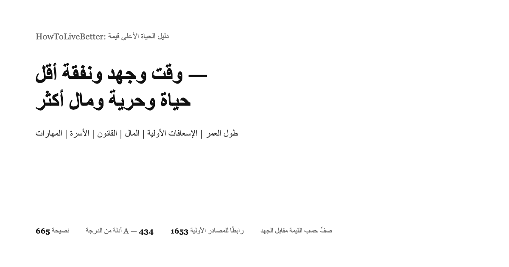

> ترجمة عربية غير رسمية لملف README.md الإنجليزي. عند وجود أي اختلاف، يُعتد بالأصل الصيني (README.zh.md).



# HowToLiveBetter: دليل الحياة الأعلى قيمة

يغطي طول العمر والوقاية من الأمراض، والحوادث والإسعافات الأولية، وتوفير المال وإدارته، والوقاية من الاحتيال والخطوط القانونية الحمراء، وشبكة أمان للبطالة، ومخاطر العمل الحر، وبناء منصة مع الالتزام بالقانون، والحب والزواج والأطفال، والسفر إلى الخارج، وتعلم المهارات.

649 نصيحة، تذكر كل واحدة منها تكلفتها وما تعيده وما درجة صلابة الدليل. تستشهد المصادر بأوراق المجلات العلمية والوثائق الرسمية فقط.


**[افتح صفحة البحث عبر الإنترنت](https://dlgrv.github.io/HowToLiveBetter/ar/)** | [جدول المحتويات](#table-of-contents) | [المصطلحات](#reading-the-numbers-glossary) | [سجلات التحقق](docs/research/核实记录/) | [هل الزواج يستحق (قراءة مطولة)](docs/research/ar/Is-Marriage-Worth-It.md) | [عدة الطوارئ المنزلية (قراءة مطولة)](docs/research/ar/Home-Emergency-Kit.md) | [هل تتوقف لمساعدة غريب (قراءة مطولة)](docs/research/ar/Should-You-Stop-To-Help-A-Stranger.md) | [ما التراخيص التي تحتاجها المنصة (قراءة مطولة)](docs/research/ar/What-Licenses-A-Platform-Needs.md)

| اللغة | الموقع | README | PDF | EPUB |
| --- | --- | --- | --- | --- |
| 🇸🇦 العربية | [اقرأ على الموقع](https://dlgrv.github.io/HowToLiveBetter/ar/) | [README.ar.md](README.ar.md) | [تنزيل PDF](https://github.com/dlgrv/HowToLiveBetter/releases/download/ebooks-latest/HowToLiveBetter-ar.pdf) | [تنزيل EPUB](https://github.com/dlgrv/HowToLiveBetter/releases/download/ebooks-latest/HowToLiveBetter-ar.epub) |
| 🇬🇧 English | [Read on the site](https://dlgrv.github.io/HowToLiveBetter/en/) | [README.md](README.md) | [Download PDF](https://github.com/dlgrv/HowToLiveBetter/releases/download/ebooks-latest/HowToLiveBetter-en.pdf) | [Download EPUB](https://github.com/dlgrv/HowToLiveBetter/releases/download/ebooks-latest/HowToLiveBetter-en.epub) |
| 🇷🇺 Русский | [Читать на сайте](https://dlgrv.github.io/HowToLiveBetter/ru/) | [README.ru.md](README.ru.md) | [Скачать PDF](https://github.com/dlgrv/HowToLiveBetter/releases/download/ebooks-latest/HowToLiveBetter-ru.pdf) | [Скачать EPUB](https://github.com/dlgrv/HowToLiveBetter/releases/download/ebooks-latest/HowToLiveBetter-ru.epub) |
| 🇨🇳 中文 | [在网站阅读](https://dlgrv.github.io/HowToLiveBetter/zh/) | [README.zh.md](README.zh.md) | [下载 PDF](https://github.com/dlgrv/HowToLiveBetter/releases/download/ebooks-latest/HowToLiveBetter-zh.pdf) | [下载 EPUB](https://github.com/dlgrv/HowToLiveBetter/releases/download/ebooks-latest/HowToLiveBetter-zh.epub) |
| 🇪🇸 Español | [Leer en el sitio](https://dlgrv.github.io/HowToLiveBetter/es/) | [README.es.md](README.es.md) | [Descargar PDF](https://github.com/dlgrv/HowToLiveBetter/releases/download/ebooks-latest/HowToLiveBetter-es.pdf) | [Descargar EPUB](https://github.com/dlgrv/HowToLiveBetter/releases/download/ebooks-latest/HowToLiveBetter-es.epub) |
| 🇧🇷 Português | [Ler no site](https://dlgrv.github.io/HowToLiveBetter/pt/) | [README.pt.md](README.pt.md) | [Baixar PDF](https://github.com/dlgrv/HowToLiveBetter/releases/download/ebooks-latest/HowToLiveBetter-pt.pdf) | [Baixar EPUB](https://github.com/dlgrv/HowToLiveBetter/releases/download/ebooks-latest/HowToLiveBetter-pt.epub) |

---

## الأسئلة التي يحاول هذا الكتاب الإجابة عنها

| السؤال | أين تنظر |
| --------------------------------------------------------------------------------------------------------------------------------------------------------------------- | ---------------------------------------------------------------------------------------------- |
| ما الذي يمكنك فعله بتكلفة شبه صفرية ويخفض احتمال الوفاة المبكرة بشكل ملموس | [1. لا تمت مبكرا](book/ar/01-Do-Not-Die-Early.md) |
| كم سنة من العمر تسلبها بالضبط كل من السجائر والكحول وقلة الحركة وقلة النوم | [2. لا تمت ببطء](book/ar/02-Do-Not-Die-Slowly.md) |
| طاقتك في اليوم لا تكفي وكثير التشتت، فكيف تعالج ذلك | [3. لا تهدر الطاقة](book/ar/03-Do-Not-Waste-Energy.md) |
| أين يذهب الوقت، وكيف تفعل أمورا عبثية أقل | [4. لا تهدر الوقت](book/ar/04-Do-Not-Waste-Time.md) |
| كيف تحفظ المدخرات حتى لا تأكلها الفوائد والرسوم والاحتيال | [5. لا تهدر المال](book/ar/05-Do-Not-Waste-Money.md) |
| ما المكملات وباقات الفحص وضرائب الذكاء التي يمكنك الاستغناء عن شرائها تماما | [6. القائمة السلبية](book/ar/06-The-Anti-List.md) |
| فقدت عملك واحتجز أجرك ولم يعد معك مال، فما الذي يمكنك المطالبة به وأين تطلب المساعدة | [7. كيف تعيش عندما لا تملك مالا](book/ar/07-Living-With-No-Money.md) |
| هدايا الخطبة والممتلكات السابقة للزواج والتحويلات الكبيرة أثناء المواعدة، لمن تعود ملكيتها في القانون | [8. لا تدخل السجن: القانون وسلامة الممتلكات](book/ar/08-Do-Not-End-Up-Inside.md) |
| بلغ عنك شخص أو اتهمك أو لفّق الوقائع، فما الخطوة الأولى، وهل يمكنك طلب الإنصاف والتعويض بعد ذلك | [8. لا تدخل السجن: القانون وسلامة الممتلكات](book/ar/08-Do-Not-End-Up-Inside.md) |
| أي الأعمال الجانبية والمعروف العابر يحول الإنسان العادي إلى متهم جنائي | [9. الخطوط القانونية الحمراء](book/ar/09-Legal-Red-Lines.md) |
| هل تخطب عدة أشخاص معا أم تلتزم بواحد، وهل تنجح العلاقة عن بعد، وماذا تحمل لتسجيل الزواج | [10. هل المواعدة والزواج يستحقان](book/ar/10-Is-Love-And-Marriage-Worth-It.md) |
| أي كتابة للشيفرة وأي وظائف قد تؤدي بك إلى السجن | [11. الخطوط الحمراء للتقنيين](book/ar/11-Red-Lines-For-Techies.md) |
| قبل الاقتراض لفتح متجر أو تأسيس شركة، ما الذي يجب التفكير فيه أولا | [12. بدء عملك الخاص](book/ar/12-Starting-Your-Own-Business.md) |
| سقط شخص وتوقف عن التنفس، أو نزف بشدة، أو نشب حريق، أو تهت في البرية، فماذا تفعل أولا | [13. الطوارئ: ماذا تفعل أولا](book/ar/13-Emergencies.md) |
| سرق حسابك أو فقدت هاتفك، فما الخطوة الأولى | [14. الحسابات والأمن](book/ar/14-Accounts-And-Security.md) |
| احتجزت الوديعة أو أخرجك المؤجر أو انهار مشغل الإيجار طويل الأجل، فماذا تفعل | [15. استئجار المساكن وشراؤها](book/ar/15-Renting-And-Buying-Housing.md) |
| بعد تشخيص مرض مزمن، كيف تديره على المدى الطويل وتنفق أقل | [16. العيش مع مرض مزمن](book/ar/16-Living-With-Chronic-Disease.md) |
| كيف ترتب مسبقا وصاية الوالد المسن ووصيته وماله | [17. المسنون في البيت](book/ar/17-Elderly-At-Home.md) |
| ما الذي يمكنك المطالبة به عند إنجاب طفل، وكم يتطلب من وقت ومال | [18. هل إنجاب الأطفال يستحق](book/ar/18-Is-Having-Kids-Worth-It.md) |
| كيف يحسب أجر العمل الإضافي والإجازة السنوية، وكم يستحق لك من تعويض عند التسريح، وكيف تقدم طلب إصابة العمل وتحصل على مستحقاتها | [19. التوظيف وإصابات العمل](book/ar/19-Employment-And-Work-Injury.md) |
| الطفل حديث الولادة، ما الأمور الأكثر أهمية | [20. المولود الجديد](book/ar/20-Newborn.md) |
| إلى أي البلدان يجب ألا تذهب الآن، وإلى أي مدى تصل الحماية القنصلية عند حدوث شيء | [21. السفر والسلامة في الخارج](book/ar/21-Travel-And-Abroad-Safety.md) |
| كيف تتجنب الاستغلال في الكاريوكي ومقاهي الإنترنت وغرف الهروب، وما الأفضل عندما تكون متوترا | [22. كيف تسترخي](book/ar/22-How-To-Relax.md) |
| تعلم اللحام والإنجليزية والشهادات، أيها يعود عليك فعلا | [23. ما المهارات التي تتعلمها](book/ar/23-Which-Skills-To-Learn.md) |
| المرض نفسه في عيادة مجتمعية ومستشفى من الدرجة الثالثة، كم يختلف في التكلفة | [24. مراجعة الطبيب](book/ar/24-Seeing-The-Doctor.md) |
| أصبت إصابة بليغة وهرعت إلى المستشفى، هل تسجل وتنتظر الدور أم تذهب إلى مكتب الفرز في الطوارئ. وهل تحتاج بعد ذلك إلى تقييم إعاقة وشهادة إعاقة | [24. مراجعة الطبيب](book/ar/24-Seeing-The-Doctor.md) |
| توفي أحد أفراد الأسرة، ماذا تفعل أولا، وأي الأموال يمكن استردادها وأي الرسوم يمكن إعفاؤها | [25. بعد وفاة شخص](book/ar/25-After-Someone-Dies.md) |
| تبني موقعا أو منصة تقبل المدفوعات، فما التراخيص المطلوبة وأين تستضيف الخوادم | [26. بناء موقع أو منصة](book/ar/26-Building-A-Website-Or-Platform.md) |
| حامل وعلى وشك الولادة، متى تفعلين ماذا، وأي الوثائق تجهزين قبل الخروج من المستشفى | [27. الحمل والولادة](book/ar/27-Pregnancy-And-Birth.md) |
| تريد إنقاص الوزن أو تحسين المظهر، فأي الممارسات تدمر الجسم | [28. لا تدمر الصحة من أجل المظهر](book/ar/28-Do-Not-Ruin-Health-For-Looks.md) |
| مات قريب أو سرحت من العمل أو تلقيت تشخيصا خطيرا، فما الأهم في الأشهر الأولى | [29. بعد ضربة كبرى](book/ar/29-After-A-Major-Blow.md) |
| بعد دخول الطفل المدرسة، ما الأمور الجسدية والنفسية التي لا تنتظر ما بعد الامتحانات | [30. أطفال سن المدرسة](book/ar/30-School-Age-Kids.md) |
| بعد سن الثامنة عشرة، ما الطرق المفتوحة غير الدراسة والعمل وما عتباتها | [31. الطرق بعد الثامنة عشرة](book/ar/31-Paths-After-Eighteen.md) |
| للدراسة في الخارج، كيف تحافظ على التأشيرة دون انقطاع، وهل تعترف الشهادة عند العودة | [32. الدراسة في الخارج](book/ar/32-Studying-Abroad.md) |
| أصبت أنت أو أحد أفراد أسرتك بإعاقة، فأي المضاعفات تمنع أولا، وأي الإعانات يمكنك المطالبة بها، وماذا عن المدرسة والعمل والوصاية | [33. العيش مع الإعاقة](book/ar/33-Living-With-Disability.md) |
| أدوية البرد وخافضات الحرارة وأدوية المعدة التي تشتريها بنفسك، ما الذي لا يجب جمعه، وما الذي يجب أن يتجنبه الأطفال والحوامل وكبار السن | [34. تجنب الضرر الجسيم من أدوية البيت](book/ar/34-Avoid-Serious-Harm-From-Home-Medicines.md) |

## كيف تقرأ هذا

- **للتصفية حسب الشروط**: افتح [صفحة البحث عبر الإنترنت](https://dlgrv.github.io/HowToLiveBetter/ar/)؛ يمكنك التصفية بالكلمة المفتاحية والفصل ودرجة الدليل، والجمع بين ثلاثة أبعاد للتكلفة: هل يكلف مالا، وهل يستغرق وقتا، وهل يتطلب إرادة. تقرأ البيانات من نصوص book/ مباشرة؛ صحح النص فتتغير صفحة البحث معه.
- **للقراءة بالترتيب**: العناصر داخل كل قسم مرتبة من الأعلى إلى الأدنى قيمة مقابل المال؛ ابدأ بالعناصر الأولى من كل قسم.
- **إذا كانت سلسلة الأرقام صعبة القراءة**: لكل عنصر سطر بعبارة مبسطة يترجم نسب الخطر وفترات الثقة في حقل المنفعة إلى عبارات يومية مثل انخفاض احتمال الوفاة في المدة نفسها بنحو 20% أو احتجاز بضعة أيام وغرامة بمقدار كذا، مستخدما فقط الوقائع الموجودة في الأصل دون إضافة أرقام جديدة. يكفي هذا السطر وحده لاتخاذ القرار؛ ويحتفظ حقل المنفعة بكل الأرقام الخام وفترات الثقة لتتحقق بنفسك.
- **للأصعب من الاستنتاجات فقط**: حدد في صفحة البحث درجة الدليل A لتحتفظ فقط بالعناصر الـ428 التي تحمل أرقاما ملموسة من تحليلات تلوية أو تجارب كبيرة.
- **للأجدر فقط**: حدد قيمة مقابل المال عالية جدا لتحصل على العناصر الـ111 التي لا تكلف مالا ولا وقتا ولا إرادة، ومنفعتها في المستوى الأكبر. أضف عليها مرشح ما تعيده لتحصل على قائمة الأولويات تحت ذلك المقياس.
- **لا يزعجك أن تبدأ عناوين الأقسام بكلمة لا**: عنوان القسم يسمي النتيجة التي يحاول القسم منعها (لا تمت مبكرا، لا تهدر الوقت)، وليس حظرا شاملا لكل عنصر تحته. عناوين العناصر هي الأفعال الفعلية، وتبدأ دائما بفعل، ويحمل كل منها افعل هذا أو لا تفعل هذا، وكلا النوعين يعيش في القسم نفسه. فمثلا يحوي القسم 4 كلا من حول سأفعل ذلك إلى في ساعة كذا وفي مكان كذا عندما يحدث X افعل ذلك وتخط التلفاز والأخبار المتداولة. اقرأ حسب عنوان العنصر لا حسب نبرة عنوان القسم.

تبدو كل نصيحة على هذا الشكل:

```markdown
### 5. استبدل ملح البيت بملح منخفض الصوديوم (البوتاسيوم)
- التكلفة: بضعة يوانات زيادة لكل كيس
- بعبارة مبسطة: في تجربة عشوائية شملت 20,000 شخص، كان احتمال الوفاة خلال خمس سنوات لدى من تحولوا إلى الملح منخفض الصوديوم أقل بنحو 12% وحالات السكتة أقل بنحو 14%. جاء ذلك من التوزيع العشوائي، وهو أوثق من بيانات المراقبة.
- المنفعة: السكتة أقل بنسبة 14%، وأحداث القلب والأوعية أقل بنسبة 13%، والوفيات لجميع الأسباب أقل بنسبة 12%
- درجة الدليل: A
- Sources: Neal B, et al. (2021). NEJM. https://doi.org/10.1056/NEJMoa2105675
- ملاحظات: محل خلاف. من يعاني ضعف وظائف الكلى أو يتناول مدرات تحفظ البوتاسيوم يجب ألا يستخدمه. ...
```

## أربعة موارد

يستهدف هذا الدليل إطالة العمر لا فقط، بل أربعة موارد:

- **العمر**: أن تعيش أطول، وأن تقل الوفيات التي كان يمكن تجنبها
- **الوقت والطاقة**: ألا يأكل وقت حياتك أنشطة بلا عائد، وأن يستنزف انتباهك اليومي وقدرتك أقل
- **المال**: أن تنفق أقل على لا شيء، وأن تضعه حيث العائد مؤكد
- **الحرية الشخصية**: ألا تسجن نفسك بالكلام لجهلك بموضع الخط الأحمر

تجيب كل نصيحة عن سؤالين: ما تكلفتها (مال / وقت / طاقة / إرادة)، وما تعيده (تغير الوفيات لجميع الأسباب / انخفاض سبب وفاة محدد / توفير وقت وطاقة / توفير مال / حماية وحرية شخصية). ترتب العناصر حسب القيمة مقابل المال لا حسب الفئة: التكلفة شبه الصفرية مع المنفعة الكبيرة تأتي أولا.

**لمن تعود المنفعة مقسم إلى مستويات.** حسب الاحتمال المتوقع لعودة الخير إليك، من الأعلى إلى الأدنى: ① **أنت نفسك**؛ ② **الزوج والأسرة المباشرة** (الوالدان والأطفال والأجداد والأحفاد)؛ ③ **الأصدقاء والزملاء وبقية الأقارب**، وهي علاقة تبادل، وما تعطيه قد يعود لاحقا؛ ④ **الغرباء**، وهو أدنى مستوى لكنه ليس صفرا: احتمال العودة صغير، ولا تعرف طبع الطرف الآخر، وفيه خطر الاحتيال والاتهام المضاد والانتقام. لا تدمج المستويات في رقم واحد؛ وعند الكتابة عن المستوى ④ تكتب المنافع والمخاطر معا.

اقرأ قسم الإسعافات الأولية بهذا المنظور: من 38,227 حالة توقف قلب خارج المستشفى في الصين، وقعت 79.2% في البيت، فتتعلم الضغطات لتدفع عن أهلك أولا. قواعد مثل لا تنزل إلى الماء بنفسك خلف غريق ولا تتدخل للفصل في شجار هي قواعد حماية ذاتية: تمنع تحولك من مشاهد إلى مصاب ثان. وهل تتصرف لأجل غريب فهو موازنة لك؛ يذكر العنصر إخلاء المسؤولية وحركات الحماية الذاتية وسطح المخاطر، ولا يقرر عنك أنه يجب فعله.

تبقى أرقام الوفيات وأرقام الوقت والطاقة وأرقام المال والتبعات القانونية في مقاييس منفصلة ولا تحول بينها. وتقابل الموارد الأربعة مرشحات ما تعيده الأربعة في صفحة البحث؛ ولا تقارن ببعضها.

## درجات الأدلة

تحمل كل نصيحة درجة دليل:

| الدرجة | المعنى |
| ----- | ------------------------------------------------------------------------------------------------------------------------ |
| A     | أدلة قابلة للقياس من تحليلات تلوية أو أتراب كبيرة أو تجارب عشوائية تعطي أرقاما ملموسة (HR وRR ونسبة الانخفاض) |
| B     | مدعوم ببحوث لكن يصعب قياسه، أو أدلة من عينات صغيرة / دراسة واحدة |
| C     | خبرة المؤلف أو إجماع عام، دون أدبيات مباشرة |

من عناصر الكتاب الـ649، هناك 428 بدرجة A و171 بدرجة B و50 بدرجة C؛ و65 عنصرا موسوما بأنه محل خلاف و3 مواضع موسومة TODO بانتظار التحقق. العناصر A/B محل الخلاف موسومة بكلمة محل خلاف مع ذكر الدليل المعارض. تستشهد كل المصادر بالأدبيات الأولية فقط (أوراق المجلات التي تحمل DOI أو رابط PubMed، أو تقارير الجهات الرسمية مثل WHO وCDC ومكتب الإحصاءات الوطني)، ولا تستشهد أبدا بروايات منقولة. الأرقام غير المؤكدة موسومة بعبارة بانتظار التحقق.

## مستويات القيمة مقابل المال

تجيب درجة الدليل عن هل يمكن الوثوق بهذا الرقم، لا عن هل يستحق الفعل. لذلك يحمل كل عنصر أيضا مقدار المنفعة والمقياس؛ وتجمع صفحة البحث بينهما وبين التكاليف الثلاثة في مستوى واحد للقيمة مقابل المال:

| البعد | القيم | كيف يحدد |
| ----------------- | --------------------------------------------------------------------- | ---------------------------------------------------------------------------------------------------------------------------------------------------------------------------------------------------------------------------------------------------------------------------------------------------------------------------------------------------------------------------------------------------------------------------------------------------------------------------------------------------------------------------------------------------- |
| المقياس | يشتري عمرا / يشتري مالا / يشتري وقتا وطاقة / يشتري حرية شخصية | حسب ما يعيده العنصر أساسا. **المقاييس لا تقارن ببعضها**: انخفاض الوفيات لجميع الأسباب بنسبة 12% وتوفير 500 يوان في السنة ليسا على مسطرة واحدة |
| مقدار المنفعة | كبيرة / متوسطة / صغيرة | يطبق آليا من عتبات حقل المنفعة في العنصر نفسه حيث أمكن: للعمر الانخفاض النسبي (20% فأكثر كبيرة، و10-20% متوسطة، وأقل من 10% أو نقاط بديلة فقط صغيرة)؛ للمال المبلغ (عشرات الآلاف كبيرة، ومئات إلى آلاف متوسطة، وعشرات اليوانات صغيرة)؛ للحرية الشخصية التبعة (تجنب المسؤولية الجنائية كبيرة، وتجنب الاحتجاز أو العقوبة الإدارية متوسطة، وتجنب نزاع مدني صغيرة)؛ للوقت والطاقة التوفير (ساعات يوميا كبيرة، وساعات أسبوعيا متوسطة، ومرة واحدة صغيرة) |
| القيمة مقابل المال | عالية جدا / عالية / عادية | منفعة كبيرة مع تكاليف ثلاثة صفرية يساوي عالية جدا؛ ومنفعة كبيرة بتكاليف منخفضة أو منفعة متوسطة بتكاليف صفرية يساوي عالية؛ والباقي يساوي عادية |

من عناصر الكتاب الـ649، هناك 111 (17%) عالية جدا و294 (45%) عالية و244 (38%) عادية. الطبقة الوسطى سميكة عن قصد: مقدار المنفعة الأصلي له ثلاثة مستويات فقط، والتقطيع الأدق يكون دقة زائفة.

**هذا المستوى حكم المؤلف لا الدليل**، وهو أساسا درجة C، ومستقل عن درجة الدليل. قد يكون العنصر درجة A لكن قيمته عادية (لقاح الحزام الناري له تجربة من المرحلة الثالثة بفعالية 97.2%، لكن الجرعتين تكلفان ثلاثة إلى أربعة آلاف يوان والحزام الناري نادرا ما يكون مميتا)، وقد يكون درجة C لكن قيمته عالية جدا (إرسال خط سيرك لأهلك قبل السفر إلى الخارج). وعادية لا تعني لا يجب فعله، فكل عنصر في الكتاب نصيحة جديرة بالأخذ؛ وتعني فقط أن تزن تلك النفقة بنفسك.

## قراءة الأرقام (مسرد المصطلحات)

يحاول النص أن يتكلم ببساطة، لكن الاستشهاد بالبحوث يتطلب بعض المصطلحات الإحصائية. راجع هذا الجدول عند الغموض؛ وفي صفحة البحث عبر الإنترنت، يؤدي تمرير المؤشر فوق كلمة تحتها خط منقط (أو لمسها) إلى إظهار الشرح.

عرض 41 مصطلحا (الوفيات لجميع الأسباب، HR، RR، فترة الثقة 95%، التحليل التلوي، BMI، LPR، العربون مقابل الدفعة المقدمة …)

| المصطلح | المعنى |
| --------------------------------------- | ---------------------------------------------------------------------------------------------------------------------------------------------------------------------------------------------------------------------------------------------- |
| الوفيات لجميع الأسباب | حصة من يموتون لأي سبب خلال مدة، بصرف النظر عن السبب. يستخدمها الكتاب لقياس كم يعيش الناس. تسميها الأدبيات الأصلية الوفيات لجميع الأسباب، واختصارها ACM |
| HR | نسبة الخطر. سرعة وصول مجموعتين إلى حدث (وفاة أو مرض) خلال المدة نفسها. HR بقيمة 0.87 يعني أقل بنسبة 13% من المجموعة الضابطة؛ وHR بقيمة 1.21 يعني أعلى بنسبة 21% |
| RR | الخطر النسبي. نسبة احتمالات الحدث بين مجموعتين؛ يقرأ مثل HR |
| OR | نسبة الأرجحية. نسبة الاحتمالات بين مجموعتين؛ تقارب RR عندما تكون الأحداث نادرة، وتضخم الفرق عندما تكون شائعة |
| IRR | نسبة معدل الحدوث؛ تقرأ مثل RR |
| RaR | نسبة المعدل (مثل عدد السقطات)؛ تقرأ مثل RR |
| نسبة الوفيات المعيارية | SMR. وفيات مجموعة فعلية مقسومة على العدد المتوقع المحسوب من وفيات عموم السكان في العمر نفسه. قيمة 5.86 تعني وفيات تعادل 5.86 أضعاف وفيات الأقران |
| فرق الخطر | احتمال الحدث في مجموعة ناقصه في الأخرى، ويعطي مباشرة كم حالة زائدة لكل ألف. النسب تقول فقط كم ضعفا؛ وفرق الخطر يقول كم شخصا أكثر بالقيمة المطلقة |
| فترة الثقة 95% | المدى الذي يقع فيه القيمة الحقيقية على الأرجح. إذا عبرت فترة من نوع النسبة الرقم 1، أو عبرت فترة من نوع الفرق الرقم 0، فقد يكون الفرق محض صدفة وسيقول النص غير دال إحصائيا |
| تجربة عشوائية محكمة | يقسم الناس عشوائيا إلى مجموعتين، تأخذ إحداهما التدخل والأخرى لا، وتقارن النتائج. أفضل دليل على السببية |
| تحليل تلوي | جمع نتائج دراسات متعددة في تقدير إجمالي واحد |
| دراسة أتراب | تتبع مجموعة من الناس لسنوات لمعرفة من تقع له الأحداث. تظهر الارتباط ولا تثبت السببية تماما |
| دراسة مراقبة | يراقب الباحثون فقط ولا يتدخلون؛ وقد تؤثر في النتائج عوامل مربكة وسببية عكسية، فاخصم من الأرقام |
| الإرباك | عامل ثالث يؤثر في السبب والنتيجة معا، فيجعل الارتباط يبدو سببية. من يأكل خضارا أكثر يميل إلى ممارسة الرياضة أكثر |
| السببية العكسية | ليس A يسبب B، بل B يسبب A. فليس أن النوم الكثير يميت مبكرا، بل أن المرضى بشدة ينامون كثيرا |
| حجم الأثر d وg | حجم الأثر. بكم انحرافا معياريا يتباعد متوسطا مجموعتين. 0.2 صغير، و0.5 متوسط، و0.8 كبير |
| معامل الارتباط r | معامل الارتباط. مدى تحرك شيئين معا، من -1 إلى 1؛ و0.1 ضعيف، و0.3 متوسط، و0.5 قوي |
| MET | وحدة شدة الجهد. 1 MET هو الجلوس بهدوء؛ والمشي السريع نحو 3 إلى 4 MET. وMET·h هي الشدة مضروبة في الساعات |
| GRADE | معيار دولي لتصنيف جودة الأدلة إلى عالية ومتوسطة ومنخفضة ومنخفضة جدا |
| تحليل نية الفحص | حساب الأثر حسب من دعي لا حسب من ذهب فعلا، وهو ما يقلل تقدير الأثر على من ذهب فعلا |
| سنة-علبة | وحدة مقدار التدخين. عدد العلب يوميا مضروبا في سنوات التدخين؛ و30 سنة-علبة تعني علبة يوميا لمدة 30 سنة |
| مؤشر كتلة الجسم BMI | مؤشر كتلة الجسم. الوزن (كغ) مقسوما على مربع الطول (م) |
| البروتين الدهني منخفض الكثافة LDL | كوليسترول البروتين الدهني منخفض الكثافة، ويقال له عامية الكوليسترول السيئ |
| معدل الترشيح الكبيبي التقديري eGFR | مقياس قدرة الكلى على الترشيح، بوحدة mL/min/1.73 m²؛ وكلما انخفض الرقم ساءت وظيفة الكلى، وتصنف به مراحل مرض الكلى المزمن |
| المستضد السطحي لالتهاب الكبد B | إيجابيته تعني الإصابة بالتهاب الكبد B |
| فيروس الورم الحليمي البشري HPV | عدوى طويلة ببعض أنواعه تسبب سرطان عنق الرحم |
| التصوير المقطعي منخفض الجرعة للصدر LDCT | إشعاعه نحو خمس إلى عشر الأشعة المقطعية العادية |
| الجسيمات الدقيقة PM2.5 | جسيمات محمولة في الهواء قطرها أقل من 2.5 ميكرومتر |
| تصنيف NOVA | تصنيف للأغذية حسب درجة التصنيع؛ والغذاء فائق التصنيع هو فئته الرابعة |
| سعر الفائدة الأساسي للقروض LPR | سعر الفائدة المرجعي للإقراض في الصين، ويصدر في يوم 20 من كل شهر؛ ويسترشد به سقف الرهن العقاري وسقف الإقراض الخاص |
| تحكيم واحد نهائي | يدخل حكم تحكيم العمل حيز النفاذ مباشرة؛ ولا يستطيع صاحب العمل رفع دعوى أمام المحكمة |
| معدل الزواج الخام ومعدل الطلاق الخام | الزيجات وحالات الطلاق المسجلة في السنة لكل ألف شخص. وقسمة حالات الطلاق على الزيجات مقياس آخر، وهو نسبة الطلاق إلى الزواج؛ فلا تخلط بينهما |
| مزيل الرجفان الخارجي الآلي AED | صندوق الإسعاف الأحمر أو الأصفر الشائع في الأماكن العامة؛ شغله واتبع التعليمات الصوتية، وهو يقرر بنفسه هل يصعق |
| الإنعاش القلبي الرئوي CPR | الضغط بقوة على الصدر أثناء توقف القلب لإبقاء الدم جاريا |
| شهادة الصين الإلزامية CCC | المنتجات في القائمة لا تخرج من المصنع ولا تباع دون هذه العلامة |
| تسجيل ICP | التسجيل الذي يكمله موقع أو تطبيق في نظام MIIT قبل الإطلاق |
| نظام الحماية المتدرجة | نظام الصين المصنف لحماية الأمن السيبراني؛ تطبق الحماية حسب أهمية النظام |
| رخصة GPL | رخصة مفتوحة المصدر. بناء منتج بشيفرتها يوجب عموما فتح مصدر منتجك عند التوزيع |
| عدم المنافسة | اتفاق ألا تلتحق بمنافس لمدة بعد المغادرة؛ وتدفع الشركة تعويضا شهريا، بسقف سنتين |
| رأس المال المكتتب | المال الموعود عند تسجيل الشركة. ما وعد به يجب دفعه فعلا خلال الأجل القانوني؛ وليس للعرض فقط |
| العربون مقابل الدفعة المقدمة | العربون القانوني (dingjin) يحمل جزاء: من أخل من الحائز رد ضعفه، بسقف 20% من العقد؛ والدفعة المقدمة (yudingjin) لا تحمل جزاء |

## جدول المحتويات

1. [لا تمت مبكرا](book/ar/01-Do-Not-Die-Early.md): أسباب الوفاة الخارجية، والغاز والتسمم، واللقاحات، والفحص، والأزمات النفسية والمدى الزمني للأفكار الانتحارية، وما يبقى بعد الإنقاذ، والسنة بعد السقوط الخطير، ودفتر بيع الكلية، وعدة الطوارئ المنزلية، والدم المرئي في البول وإشارات أخرى تستحق الفحص. المقياس: الوفيات لجميع الأسباب أو أسباب محددة.
2. [لا تمت ببطء](book/ar/02-Do-Not-Die-Slowly.md): التدخين والكحول، والرياضة، والنوم، والنظام الغذائي، والجلوس. المقياس: الوفيات لجميع الأسباب أو أسباب محددة.
3. [لا تهدر الطاقة](book/ar/03-Do-Not-Waste-Energy.md): النوم، والانقطاعات، وتعدد المهام، وإجهاد القرار، والديون الاجتماعية، وما تتوقعه عند التعامل مع الجهات والموظفين. المقياس: الطاقة/الوقت.
4. [لا تهدر الوقت](book/ar/04-Do-Not-Waste-Time.md): مشاريع بلا عائد، والتكاليف الغارقة، والتسويف، والاجتماعات، والتنقل. المقياس: الوقت.
5. [لا تهدر المال](book/ar/05-Do-Not-Waste-Money.md): الاشتراكات، واليانصيب، والفوائد، والتأمين، ورسوم الصناديق، والمعاش الشخصي، وتأمين السيارات، والمدفوعات المسبقة، والتسوق بالبث المباشر، وحساب التوفير الطبي، واحتيال الأطفال على الأبناء واسترداد مشتريات الألعاب. المقياس: المال.
6. [القائمة السلبية](book/ar/06-The-Anti-List.md): أمور تبدو ذات قيمة جيدة وهي ليست كذلك.
7. [كيف تعيش عندما لا تملك مالا](book/ar/07-Living-With-No-Money.md): الإغاثة، والإعانات، وإيجاد العمل، والسكن والطعام، والرعاية الطبية، وسبل تحصيل الأجور المتأخرة، والفخاخ التي تتجنبها. المقياس: المال/الحماية.
8. [لا تدخل السجن: القانون وسلامة الممتلكات](book/ar/08-Do-Not-End-Up-Inside.md): حوادث المرور، والاحتيال وتجميد المدفوعات، وتزييف الوجه والصوت بالذكاء الاصطناعي، وسبل الإنصاف بعد الاتهام والبلاغ الكاذب، والحد بين الابتزاز بالتبليغ والمطالبة بتعويضك، والنزاع والعنف الشديد بدافع الحقد، والأذى الاندفاعي وحق الأسرة في طلب الاستشفاء، والبوابات القانونية الأربع لتأمين أحد أفراد الأسرة قبل إيذائه، وبعد الهجوم الجماعي عبر الإنترنت: مسارات المنصة والأوامر القضائية، وهدايا الخطبة، والممتلكات السابقة للزواج، والكفالات، ومكافحة الاحتيال، ومدد التقادم، والتنفيذ وقوائم المدينين غير الصادقين، ومسؤولية مالك الكلاب. المقياس: المال/الحرية الشخصية.
9. [الخطوط القانونية الحمراء](book/ar/09-Legal-Red-Lines.md): الشائعات، وإهانة الأبطال والشهداء، والمحتوى الأجنبي الذي يجوز قراءته دون إعادة نشره، وتوزيع المواد الإباحية، وغسل الأموال بدوام جزئي، وتزوير المستندات للقروض، وتلفيق الحوادث والمطالبات المبالغ فيها، ورمي الأشياء من عل، وبنادق المحاكاة، والطائرات المسيرة، والتصوير الخفي، والحد بين التبني القانوني عند العجز عن التربية والاتجار أو الهجر، والقمار، ولحوم الحيوانات البرية، وبيع الأعضاء والوساطة في المتبرعين. المقياس: الحرية الشخصية/المال.
10. [هل المواعدة والزواج يستحقان](book/ar/10-Is-Love-And-Marriage-Worth-It.md): استراتيجية البحث عن شريك، والخط الأحمر للمضايقة، وإشارات الاهتمام، وجودة العلاقة، والعلاقة عن بعد، وإجراءات التسجيل، والفحص قبل الزواج، ودفتر الصحة، ودفتر الوقت، ودفتر المال، وتمويل الأهل للمسكن والديون الزوجية المشتركة، وتكاليف الخروج. قراءة مطولة: [هل الزواج يستحق (قراءة مطولة)](docs/research/ar/Is-Marriage-Worth-It.md).
11. [الخطوط الحمراء للتقنيين](book/ar/11-Red-Lines-For-Techies.md): غش الألعاب، وزواحف الويب، وسكربتات حجز التذاكر، ومسح قواعد البيانات، وأخذ الشيفرة المصدرية معك، وتطوير العقود، وعدم المنافسة، وتراخيص المصادر المفتوحة، وتسجيل ICP. المقياس: الحرية الشخصية/المال.
12. [بدء عملك الخاص](book/ar/12-Starting-Your-Own-Business.md): رأس المال، والكفالات، واختيار الكيان، والتسجيل، والتراخيص، وتقديم الضرائب، والفواتير، وحيل الضرائب، والعقود، والتوظيف، والإنتاج الكمي، والخطوط الحمراء للملكية الفكرية في التوريد والصور، والخروج. المقياس: المال/المسؤولية القانونية.
13. [الطوارئ: ماذا تفعل أولا](book/ar/13-Emergencies.md): توقف القلب، والسكتة والسكتة الخلفية، وسكتة العين، والنوبة القلبية، وتسلخ الأبهر، والصداع الرعدي، والورم الدموي المزمن تحت الجافية، والانصمام الرئوي، والنزف الشديد، والعضات، والحروق والسمط، والصدمة التحسسية، والنوبات، وهبوط السكر، والصعق الكهربائي، وأول أكسيد الكربون، وابتلاع السموم والحروق الكيميائية، والأجسام المغروزة في الجسم، وتثبيت الكسور، والاحتيال، وتهديدات الخصوصية، وضربة الشمس، والحريق، والغرق، والضياع، وانخفاض الحرارة، وعضة الثعبان، والزلازل، والحيوانات البرية، والبرق، وداء المرتفعات، والقراد، ومياه الشرب في البرية؛ وهل تقدر على الإنقاذ: كيف تساعد مسنا ساقطا، وماذا تفعل عندما تشهد شجارا، ومن يدفع إذا أصبت أثناء المساعدة. المقياس: البقاء والمال؛ والعناصر الأخيرة تمس الحرية الشخصية أيضا.
14. [الحسابات والأمن](book/ar/14-Accounts-And-Security.md): المصادقة الثنائية، وكلمات المرور، وبطاقات SIM، والهواتف المفقودة، والاحتيال المصرفي، والأجهزة المسجلة، وأذونات التطبيقات، والتعرف على الوجه، والحق في الوصول والحذف. المقياس: المال/المعلومات الشخصية.
15. [استئجار المساكن وشراؤها](book/ar/15-Renting-And-Buying-Housing.md): الودائع، والإخلاء العنيف، والوكلاء الذين يجمعون الإيجار، وضمان الأموال، والبيع لا يفسخ الإيجار، والتحقق من الملكية، وحسابات المعاملات المخصصة، والغرف المقسمة. المقياس: المال.
16. [العيش مع مرض مزمن](book/ar/16-Living-With-Chronic-Disease.md): الالتزام بالأدوية، وتسوية العيادات المزمنة عبر المقاطعات، وسجلات المتابعة، وعدم إيقاف الأدوية لأجل وصفات شعبية، والوصفات الطويلة، والتعاقد مع طبيب أسرة، وفحص المضاعفات، والوقاية من تكرار حصى الكلى، والعلاج الخافض لحمض البول الموجه بالهدف للنقرس. المقياس: الوفيات لجميع الأسباب/المال.
17. [المسنون في البيت](book/ar/17-Elderly-At-Home.md): الوصاية الطوعية، وأشكال الوصية، والحسابات والنصوص، وحيل الاستثمار للتقاعد ورهن البيت للتقاعد، وتأمين الرعاية طويلة الأجل، والوقاية من قرح الفراش للملازمين للفراش. المقياس: المال/الحرية الشخصية.
18. [هل إنجاب الأطفال يستحق](book/ar/18-Is-Having-Kids-Worth-It.md): إعانات تربية الأطفال، وإجازة الأمومة والبدل، والحماية أثناء الحمل والأمومة والرضاعة، ودفتر الوقت، ودفتر المال. المقياس: المال/الوقت.
19. [التوظيف وإصابات العمل](book/ar/19-Employment-And-Work-Injury.md): أجر العمل الإضافي، والإجازة السنوية، وفترة التجربة؛ والإفصاح عن مخاطر المهنة والفحوص الثلاثة، والحماية من الغبار والضجيج؛ وN وبدل الإشعار و2N، وعدم توقيع استقالة طوعية، وحفظ الأدلة؛ وآجال تقديم إصابات العمل، وصاحب العمل بلا تغطية، وتقييم القدرة على العمل، ومستحقات الوفاة أثناء العمل. المقياس: المال.
20. [المولود الجديد](book/ar/20-Newborn.md): النوم الآمن، والجرعة الأولى من لقاح التهاب الكبد B، واللقاحات المجدولة، والرضاعة الطبيعية والأغذية التكميلية، وحرارة ماء الحليب الصناعي، والعسل، وفيتامين K، ومتى تعني الحمى المستشفى، وعدم الهز أبدا، والحفاضات والمشتريات الكبيرة. المقياس: وفيات الرضع/المال.
21. [السفر والسلامة في الخارج](book/ar/21-Travel-And-Abroad-Safety.md): مستويات تحذيرات السفر، و12308، وحدود الحماية القنصلية، والتأمين الطبي في الخارج، وحيل التوظيف بأجور عالية في الخارج، وفقدان الوثائق، ورخص القيادة الأجنبية، وتسجيل الوكالات. المقياس: المال/الحرية الشخصية.
22. [كيف تسترخي](book/ar/22-How-To-Relax.md): مخارج الطوارئ، والأسعار الواضحة، والخطوط الحمراء للمخدرات، وما يسلم إليك، والاسم الحقيقي في مقاهي الإنترنت، واختيارات الأماكن لألعاب الغموض؛ والرياضة، واليقظة، والتنفس، والتواصل، والمساحات الخضراء. المقياس: المال/الحرية الشخصية، إضافة إلى الطاقة/الوفيات لجميع الأسباب.
23. [ما المهارات التي تتعلمها](book/ar/23-Which-Skills-To-Learn.md): الدراسة أو العمل (خط سن عمل الأطفال، والتعليم والوفيات، والبنية التعليمية الوطنية، والإعفاء من الرسوم والمنح والقروض، ومسارات الكليات المهنية، وكيف تحسب الأرقام بنفسك)، وعوائد التعليم، والشهادات المزيفة، وإعانات التدريب، والأبعاد المقاومة للأتمتة، ومستويات المهارة، وكيف تبحث عن المهن الناقصة. المقياس: المال/الوقت، وعنصر واحد عن الوفيات.
24. [مراجعة الطبيب](book/ar/24-Seeing-The-Doctor.md): الرعاية المتدرجة والإحالات، والعد التراكمي للخصم، وفروق نسب السداد، ومواعيد الحجز المحفوظة، وهل يستحق السفر للعلاج، وحفظ السجلات الطبية وختمها، وترتيب الفرز الرباعي في الطوارئ، والإغاثة الطارئة عند العجز عن الدفع، ومتى تجري تقييم الإعاقة، وكيف تحصل على شهادة إعاقة، ولا حاجة لرشوة طبيبك. المقياس: المال/الوقت.
25. [بعد وفاة شخص](book/ar/25-After-Someone-Dies.md): التبليغ وشهادة الوفاة، ونقل الجثمان وحرقه، والطعن في السبب والتشريح، وإلغاء تسجيل الأسرة، وقائمة الخدمات الجنائزية الأساسية، ومخالفات الأسعار، وتسجيل الوكالات، ورصيد صندوق الإسكان ومستحقات الضمان الاجتماعي، وحقوق المعلومات الشخصية للمتوفى. المقياس: المال.
26. [بناء موقع أو منصة](book/ar/26-Building-A-Website-Or-Platform.md): الخط الأحمر لتسوية المدفوعات، وتراخيص ICP والتسجيل، وتراخيص البث المباشر والمرئي والمسموع، وتحقق المنصة والتبليغ الضريبي، وحوكمة المحتوى، وقواعد الاسم الحقيقي، والقاصرون، والإشعار والحذف، وخروج البيانات من البلاد، واختيارات الخوادم. المقياس: الحرية الشخصية/المال. قراءة مطولة: [ما التراخيص التي تحتاجها المنصة (قراءة مطولة)](docs/research/ar/What-Licenses-A-Platform-Needs.md).
27. [الحمل والولادة](book/ar/27-Pregnancy-And-Birth.md): حمض الفوليك، والتسجيل والفحوص المجانية قبل الولادة، وفحص الأمراض الثلاثة ومنع انتقالها من الأم للطفل، والتدخين والكحول في الحمل، والأسبرين وسكري الحمل، وإشارات الذهاب إلى المستشفى فورا، وماذا تفعلين عند نزول الماء، والولادة بلا ألم، واستطبابات القيصرية، وتأمين الأمومة، وشهادة الميلاد، وفحص حديثي الولادة، والتسجيل والقيد، وفحص اليوم 42 بعد الولادة. المقياس: الوفيات والمال.
28. [لا تدمر الصحة من أجل المظهر](book/ar/28-Do-Not-Ruin-Health-For-Looks.md): الحميات القاسية واضطرابات الأكل، والترخيصان لمؤسسات التجميل الطبي والأطباء الرئيسيين، ومناطق خطر العمى في حقن الوجه، ومنتجات الحمية المغشوشة غير القانونية بالسيبوترامين، والستيرويدات الابتنائية، والوصفات والمتابعة لحبوب الحمية والهرمونات الجنسية، وتقييم صورة الجسم. المقياس: الوفيات (نقاط صحية)؛ وعنصرا التجميل الطبي يمسان الحرية الشخصية أيضا.
29. [بعد ضربة كبرى](book/ar/29-After-A-Major-Blow.md): نافذة القلب والأوعية في الشهر الأول بعد الفقد، والأسبوع الأول بعد تشخيص خطير، وفقدان العمل، والأشهر الستة بعد وفاة الزوج، والفقد بالانتحار، واستبدال الشخص الواحد بثلاثة أشياء عند غياب الأسرة والأصدقاء، والأطفال الذين فقدوا والدا، وأين تسجل عندما يعلق الحزن، والطلاق، و12356 و12355، ولا تتخذ قرارات لا رجعة فيها تحت التوتر الحاد، ولماذا لا ينجح الموت هربا من الدين. المقياس: الوفيات لجميع الأسباب؛ والأخيران عن المال.
30. [أطفال سن المدرسة](book/ar/30-School-Age-Kids.md): طوارئ تحسب بالساعة، ولا تؤجل العلاج لأجل الامتحانات، وماذا تفعل حيال التنمر، وساعتان في الخارج يوميا، وتقرير الفحص المدرسي، وفحص اكتئاب المراهقين، والمنتجات المدعية علاج قصر النظر، والقواعد الصارمة للنوم والواجبات، والإيقاف مع حفظ القيد، وفحص العين الموسع والمتابعة، وسداد شقوق الأسنان. المقياس: الوفيات والنقاط الصحية، إضافة إلى عنصر أو عنصرين عن المال والوقت.
31. [الطرق بعد الثامنة عشرة](book/ar/31-Paths-After-Eighteen.md): العتبات القانونية للطرق الثمانية؛ والخدمة العسكرية (التسجيل، وسنتان مجندا، والعقاب المشترك لرفض الخدمة، وتعويض الرسوم ومواصلة الدراسة، والتوظيف وتقرير 30 يوما، وأجر التسريح وضريبة الأقدمية)؛ وامتحانات التوظيف الموجهة لبرامج خدمة القاعدة؛ والتوظيف بعد مناصب التعليم الأول؛ ورجال الإطفاء والوظائف المدنية العسكرية؛ والدراسة الذاتية وامتحان الكبار والجامعة المفتوحة؛ والضمان الاجتماعي في العمل المرن؛ وحماية الإصابات لسعاة التوصيل. المقياس: المال/الوقت؛ وعنصر رفض الخدمة يمس الحرية الشخصية أيضا.
32. [الدراسة في الخارج: الإقامة والعمل والتأمين ومعادلة الشهادة](book/ar/32-Studying-Abroad.md): تحقق من قائمة الاعتماد قبل دفع الرسوم؛ وفترة القبول الثابتة في الولايات المتحدة ونافذة المغادرة 30 يوما اعتبارا من سبتمبر 2026؛ وسقوف ساعات العمل في الولايات المتحدة وكندا وبريطانيا وأستراليا؛ والدوام الكامل أساس إقامتك؛ والتبليغ عن عنوان جديد خلال 10 أيام؛ وتحذيرات وزارة التعليم للدراسة في الخارج؛ وتأمين OSHC الأسترالي الذي لا يجوز انقطاعه؛ ورسم الرعاية الصحية البريطاني؛ و10-20 يوم عمل تحفظها لمعادلة شهادة العودة. المقياس: المال والحرية الشخصية.
33. [كيف تعيش بعد الإعاقة](book/ar/33-Living-With-Disability.md): العقد الأول بعد الحدث المسبب للإعاقة هو نافذة الخطر الأعلى للانتحار؛ والاستشفاء الطوعي للاضطرابات النفسية واستثناؤه؛ ووسائد تخفيف الضغط لمستخدمي الكراسي المتحركة؛ والأجهزة المساعدة وتعديلات البيت عبر اتحاد المعوقين؛ وطلبات شهادة الإعاقة وبدل المعيشة؛ والتمييز في القبول المدرسي والتوظيف وكيف ترد عليه
34. [تجنب الضرر الجسيم من أدوية البيت](book/ar/34-Avoid-Serious-Harm-From-Home-Medicines.md): لا تضاعف الأسيتامينوفين؛ ولا أسبرين ولا نيميسوليد ولا أنالجين لحمى الأطفال؛ ومن هم الأكثر عرضة لضرر الإيبوبروفين على المعدة؛ ولا أدوية برد مركبة تحت سن 2 دون طبيب؛ ولا إيبوبروفين ذاتي بعد الأسبوع 20 من الحمل؛ والأوميبرازول الذاتي 7 أيام على الأكثر؛ ولا مضادات حيوية للزكام؛ وعوض السوائل أولا للإسهال ولا تعط مضادات الإسهال للأطفال؛ وفرط استخدام المسكنات قد يسبب مزيدا من الصداع. المقياس: الوفيات.

داخل كل قسم ترتب العناصر من الأعلى إلى الأدنى قيمة مقابل المال. عناوين الأقسام مثل لا تمت مبكرا أو لا تهدر الوقت تسمي النتيجة التي يحاول القسم منعها؛ وهل العنصر أمر أو نهي فيقرره عنوان العنصر. قراءات مطولة: [عدة الطوارئ المنزلية (قراءة مطولة)](docs/research/ar/Home-Emergency-Kit.md)، و[ما التراخيص التي تحتاجها المنصة (قراءة مطولة)](docs/research/ar/What-Licenses-A-Platform-Needs.md)، و[هل الزواج يستحق (قراءة مطولة)](docs/research/ar/Is-Marriage-Worth-It.md)، و[هل تتوقف لمساعدة غريب (قراءة مطولة)](docs/research/ar/Should-You-Stop-To-Help-A-Stranger.md). وسجل التحقق لكل مصدر مستشهد به في [docs/核实记录](docs/research/核实记录/).

`site/index.html` هو قالب صفحة البحث عبر الإنترنت؛ ويكتب `make web-build` صفحات اللغات تحت `site/{en,ru,es,zh}/`. تقرأ البيانات من `README*.md` الجذرية ومن `book/` (تنسخ بجانب الموقع في مصنوع Pages). ينشر GitHub Pages عبر Actions (`.github/workflows/pages.yml`)، وفي إعدادات المستودع ثم Pages اضبط المصدر على **GitHub Actions**. محليا: شغل `make serve` ثم افتح [http://127.0.0.1:8000/ar/](http://127.0.0.1:8000/ar/).

## الكتاب نفسه

ينقسم النص إلى 34 ملف فصول تحت [book/ar/](book/ar/)؛ وانقر عنوان فصل في جدول المحتويات أعلاه لتفتحه. قسم لأنه لو كان ملفا واحدا لتجاوز حد GitHub البالغ 512 KB لعرض Markdown ولما ظهرت الفصول الأخيرة؛ وتقرأ [صفحة البحث عبر الإنترنت](https://dlgrv.github.io/HowToLiveBetter/ar/) هذه الملفات مجمعة وتعمل بالطريقة نفسها.
