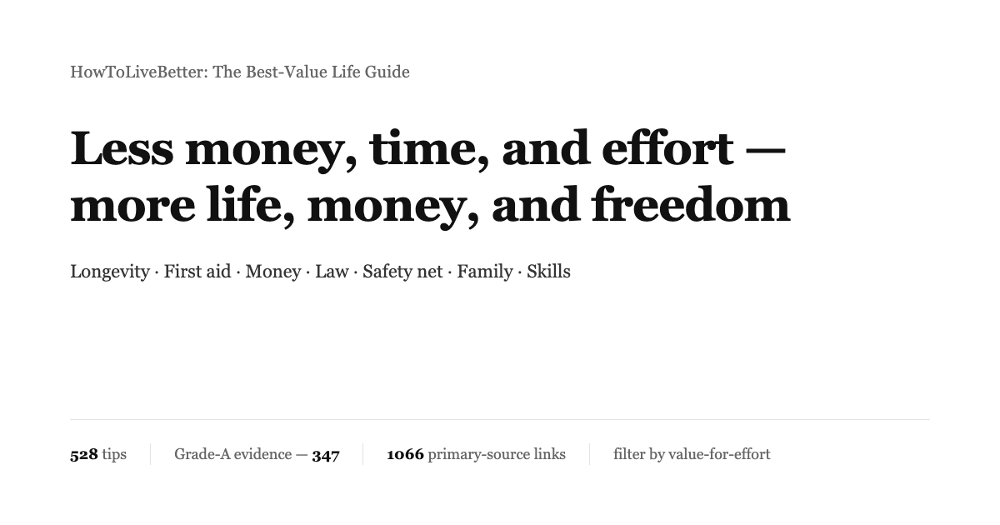

<div align="center">



# HowToLiveBetter: The Best-Value Life Guide

Covers longevity and disease prevention, accidents and first aid, saving money and managing it, fraud prevention and legal red lines, a safety net for unemployment, the risks of running your own business, building a platform and keeping it legal, love, marriage, and children, going abroad, and learning skills.<br>
528 pieces of advice; each one states what it costs, what it buys back, and how hard the evidence is. Sources cite only journal papers and official documents.

[](https://eternity4719.github.io/HowToLiveBetter/)
[](#table-of-contents)
[](#evidence-grades)
[](docs/核实记录/)
[](LICENSE)

**[Open the online search page](https://eternity4719.github.io/HowToLiveBetter/)** · [Table of contents](#table-of-contents) · [Glossary](#reading-the-numbers-glossary) · [Verification records](docs/核实记录/) · [Is marriage worth it (long read)](docs/结婚划不划算.md) · [Home emergency kit (long read)](docs/家庭应急装备清单.md) · [Should you stop to help a stranger (long read)](docs/遇到陌生人出事该不该停.md) · [What licenses a platform needs (long read)](docs/做平台要办哪些证.md)

</div>

**Languages / Языки:**
- 🇬🇧 [English](README.md) → [site](https://dlgrv.github.io/HowToLiveBetter/en/)
- 🇷🇺 [Русский](README.ru.md) → [сайт](https://dlgrv.github.io/HowToLiveBetter/ru/)
- 🇨🇳 [中文](README.zh.md) → [网站](https://dlgrv.github.io/HowToLiveBetter/zh/)

---

## Questions this book tries to answer

| Question | Where to look |
| --- | --- |
| What can you do almost for free that still noticeably lowers your chance of dying early? | [1. Do Not Die Early](book/en/01-Do-Not-Die-Early.md) |
| How many years of life exactly do smoking, alcohol, a sedentary life, and sleep loss take away? | [2. Don't Die Slowly](book/en/02-Do-Not-Die-Slowly.md) |
| Not enough energy in a day, constantly interrupted — how do you fix it? | [3. Don't Waste Energy](book/en/03-Do-Not-Waste-Energy.md) |
| Where does the time go, and how do you do fewer pointless things? | [4. Don't Waste Time](book/en/04-Do-Not-Waste-Time.md) |
| How should savings be kept so that interest, fees, and scams don't eat them? | [5. Don't Waste Money](book/en/05-Do-Not-Waste-Money.md) |
| Which supplements, checkup packages, and "IQ taxes" can you simply not buy? | [6. The Negative List](book/en/06-The-Anti-List.md) |
| You lost your job, your wages are withheld, you have no money — what can you claim and where do you ask for help? | [7. How to Live When You Have No Money](book/en/07-Living-With-No-Money.md) |
| Betrothal gifts, premarital property, large transfers during dating — who owns what in law? | [8. Don't Get Yourself Locked Up: Law and Property Safety](book/en/08-Do-Not-End-Up-Inside.md) |
| Someone reports you, accuses you, fabricates facts — what is the first step, and can you seek redress and compensation afterwards? | [8. Don't Get Yourself Locked Up: Law and Property Safety](book/en/08-Do-Not-End-Up-Inside.md) |
| Which "side jobs" and casual favors turn an ordinary person into a criminal defendant? | [9. Legal Red Lines](book/en/09-Legal-Red-Lines.md) |
| Should you court many people at once or commit to one, can long-distance work, what do you bring to register a marriage? | [10. Are Dating and Marriage Worth It](book/en/10-Is-Love-And-Marriage-Worth-It.md) |
| Writing which code, taking which jobs can get you a prison sentence? | [11. Red Lines for Techies](book/en/11-Red-Lines-For-Techies.md) |
| Before borrowing to open a shop or founding a company, what should you think through first? | [12. Starting Your Own Business](book/en/12-Starting-Your-Own-Business.md) |
| Someone collapses and stops breathing, heavy bleeding, fire, lost in the wild — what do you do first? | [13. Emergencies: What to Do First](book/en/13-Emergencies.md) |
| Account stolen, phone lost — what is the first step? | [14. Accounts And Security](book/en/14-Accounts-And-Security.md) |
| Deposit withheld, landlord evicting you, long-term rental operator collapsed — what do you do? | [15. Renting And Buying Housing](book/en/15-Renting-And-Buying-Housing.md) |
| After a chronic disease diagnosis, how do you manage it long-term and spend less? | [16. Living With Chronic Disease](book/en/16-Living-With-Chronic-Disease.md) |
| How should an elderly parent's guardianship, will, and money be arranged in advance? | [17. Elderly At Home](book/en/17-Elderly-At-Home.md) |
| What can you claim when having a child, and how much time and money does it take? | [18. Is Having Kids Worth It](book/en/18-Is-Having-Kids-Worth-It.md) |
| How are overtime pay and annual leave counted, how much compensation does a layoff owe you, how do you file and get paid for a workplace injury? | [19. Employment And Work Injury](book/en/19-Employment-And-Work-Injury.md) |
| The child is just born — which things matter most? | [20. Newborn](book/en/20-Newborn.md) |
| Which countries not to go to now, and how far does consular protection go when something happens? | [21. Travel And Abroad Safety](book/en/21-Travel-And-Abroad-Safety.md) |
| How not to get burned at KTV, internet cafés, escape rooms; and what works best when you're stressed? | [22. How To Relax](book/en/22-How-To-Relax.md) |
| Learning welding, English, certificates — which ones really pay back? | [23. Which Skills To Learn](book/en/23-Which-Skills-To-Learn.md) |
| Same illness at a community clinic and a tier-III hospital — how different is the cost? | [24. Seeing The Doctor](book/en/24-Seeing-The-Doctor.md) |
| Badly injured and rushing to a hospital — register and queue, or go to the ER triage desk? Afterwards, do you need a disability assessment, a disability certificate? | [24. Seeing The Doctor](book/en/24-Seeing-The-Doctor.md) |
| A family member has died — what to do first, which money can be recovered, which fees can be waived? | [25. After Someone Dies](book/en/25-After-Someone-Dies.md) |
| Building a website or platform that takes payments — which licenses, where to host servers? | [26. Building A Website Or Platform](book/en/26-Building-A-Website-Or-Platform.md) |
| Pregnant, about to give birth — when to do what, and which documents to arrange before discharge? | [27. Pregnancy And Birth](book/en/27-Pregnancy-And-Birth.md) |
| You want to lose weight or look better — which practices wreck your body? | [28. Do Not Ruin Health For Looks](book/en/28-Do-Not-Ruin-Health-For-Looks.md) |
| A relative died, you were laid off, you got a serious diagnosis — what matters most in the first months? | [29. After A Major Blow](book/en/29-After-A-Major-Blow.md) |
| Once the child starts school, which physical and mental things cannot wait until after the exams? | [30. School-Age Kids](book/en/30-School-Age-Kids.md) |
| After eighteen, besides studying and working, which roads are open — and what are their thresholds? | [31. Paths After Eighteen](book/en/31-Paths-After-Eighteen.md) |

## How to read this

- **To filter by conditions**: open the [online search page](https://eternity4719.github.io/HowToLiveBetter/); you can filter by keyword, chapter, and evidence grade, and combine three cost dimensions: whether it costs money, whether it takes time, whether it takes willpower. The data is read directly from the book/ text; fix the text and the search page changes with it.
- **To read in order**: items inside each section are ordered from highest to lowest value for the money; start with the first few items of each section.
- **If you can't read that string of numbers**: every item has an "In plain terms" line that translates the risk ratios and confidence intervals in the Benefit field into everyday statements like "about 20% lower chance of dying in the same period" or "a few days of detention, a fine of so much" — using only facts already in the original, without adding new numbers. That line alone is enough to decide; the Benefit field keeps all the raw numbers and confidence intervals so you can check for yourself.
- **Only the hardest conclusions**: on the search page check evidence grade A to keep only the 347 items with concrete numbers from meta-analyses or large trials.
- **Only the most worthwhile**: check "very high" value-for-money to get the 99 items that cost no money, no time, no willpower, and whose benefit lands in the largest tier. Stack one more "what it buys back" filter on top and you have the priority list under that measure.
- **Don't be alarmed by section titles that start with "Don't"**: a section title names the outcome that section tries to prevent (don't die early, don't waste time), not a blanket ban on every item under it. Item titles are the actual actions, always starting with a verb, each carrying its own "do this" or "don't do this" — both kinds live in the same section. For example, section 4 has both "Turn 'planning to do it' into 'at such an hour, in such a place, when X happens, do it'" and "Skip TV and rolling news". Read by item title, not by the tone of the section title.

Each piece of advice looks like this:

```markdown
### 5. Switch your household salt to low-sodium (potassium) salt
- Cost: a few yuan more per bag
- In plain terms: in a randomized trial of 20,000 people, those who switched to low-sodium salt had about a 12% lower chance of dying within five years and about 14% fewer strokes. This comes from random assignment, which is more trustworthy than observational data.
- Benefit: stroke down 14%, cardiovascular events down 13%, all-cause mortality down 12%
- Evidence grade: A
- Sources: Neal B, et al. (2021). NEJM. https://doi.org/10.1056/NEJMoa2105675
- Notes: contested. People with impaired kidney function or on potassium-sparing diuretics should not use it. ...
```

## Four resources

This guide optimizes not just lifespan but four resources:

- **Lifespan**: live longer, die less often from things that were avoidable
- **Time and energy**: the time you are alive is not eaten by zero-return activities, and your daily attention and stamina are drained less
- **Money**: spend less money on nothing, put it where the payoff is certain
- **Personal freedom**: don't talk yourself into detention or jail by not knowing where a red line runs

Every piece of advice answers two questions: what it costs (money / time / energy / willpower), and what it buys back (all-cause mortality change / a specific cause of death down / time and energy saved / money saved / protection and personal freedom). Items are ordered by value for money, not by category: near-zero cost with large benefit goes first.

**Whose account the benefit lands on is tiered.** By the expected chance that the good comes back to you, from high to low: ① **you yourself**; ② **spouse and immediate family** (parents, children, grandparents, grandchildren); ③ **friends, colleagues, and other relatives** — a reciprocal relationship, what you give may come back later; ④ **strangers** — the lowest tier, but not zero: the chance of return is small, you don't know the other person's character, and there is the risk of being scammed, counter-accused, or retaliated against. Tiers are not merged into one number; when writing about tier ④, the benefits and the risks are written together.

Read the first-aid section with this in mind: of 38,227 out-of-hospital cardiac arrests in China, 79.2% happened at home — you learn compressions first of all to press on your own family. Rules like "do not go into the water yourself after a drowning person" and "don't step in to separate a fight" are self-protection rules: they guard against you turning from bystander into second casualty. Whether to act for a stranger is your own trade-off; the item spells out the liability disclaimer, the self-protective moves, and the risk surface, and does not decide for you that it must be done.

Mortality numbers, time/energy numbers, money numbers, and legal consequences are kept in separate measures and never converted across measures. The four resources correspond to the four "what it buys back" filters on the search page; they are not compared with each other.

## Evidence grades

Every piece of advice carries an evidence grade:

| Grade | Meaning |
| --- | --- |
| A | Quantifiable evidence from meta-analyses, large cohorts, or RCTs that gives concrete numbers (HR, RR, percent reduction) |
| B | Research-backed but hard to quantify, or evidence from small samples / a single study |
| C | Author experience or general consensus, no direct literature |

Of the 528 items in the book, 347 are grade A, 131 grade B, and 50 grade C; 47 items are marked as contested and 39 spots are marked TODO, pending verification. Contested A/B items are marked "contested" with the opposing evidence listed. All sources cite primary literature only (journal papers with a DOI or PubMed link, or reports from official bodies such as WHO, CDC, or the national statistics bureau), never second-hand retellings. Uncertain numbers are marked "to be verified".

## Value-for-money tiers

The evidence grade answers "can this number be trusted", not "is it worth doing". So every item also carries a benefit magnitude and a measure; the search page combines these with the three costs into one value-for-money tier:

| Dimension | Values | How it is set |
| --- | --- | --- |
| Measure | Buys lifespan / buys money / buys time-energy / buys personal freedom | By what the item mainly buys back. **Measures are not compared with each other**: "all-cause mortality down 12%" and "save 500 yuan a year" are not on one ruler |
| Benefit magnitude | Large / medium / small | Mechanically applied from thresholds in the item's own Benefit field where possible: for lifespan, relative reduction (≥20% large, 10–20% medium, <10% or only surrogate endpoints small); for money, the amount (tens of thousands large, hundreds to thousands medium, tens of yuan small); for personal freedom, the consequence (avoiding criminal liability large, avoiding detention or administrative punishment medium, avoiding a civil dispute small); for time-energy, the saving (hours a day large, hours a week medium, one-off small) |
| Value for money | Very high / high / ordinary | Large benefit with all three costs zero = very high; large benefit with low costs, or medium benefit with zero costs = high; the rest = ordinary |

Of the 528 items in the book, 100 (19%) are very high, 256 (48%) high, and 172 (33%) ordinary. The middle tier is deliberately thick: the underlying benefit magnitude has only three levels, and slicing finer would be false precision.

**This tier is the author's judgment, not evidence** — essentially grade C, and orthogonal to the evidence grade. An item can be grade A but ordinary value (the shingles vaccine has a phase-III RCT at 97.2% efficacy, but two doses cost three to four thousand yuan and shingles is rarely fatal), and it can be grade C but very high value (sending your itinerary to family before going abroad). "Ordinary" does not mean "shouldn't be done" — every item in the book is advice worth taking; it only means you should weigh that spend yourself.

## Reading the numbers (glossary)

The text tries to speak plainly, but citing research requires a few statistical terms. Check this table when something is unclear; on the online search page, hovering over (or tapping) a dotted-underlined word also pops up an explanation.

<details>
<summary>Expand 41 terms (all-cause mortality, HR, RR, 95% CI, meta-analysis, BMI, LPR, deposit vs prepayment …)</summary>

| Term | Meaning |
| --- | --- |
| All-cause mortality | The share of people dying from any cause over a period, regardless of cause. The book uses it to measure "how long people live". The original literature calls it all-cause mortality, abbreviated ACM |
| HR | Hazard ratio. The speed at which two groups hit an event (death, illness) over the same time. HR 0.87 means 13% lower than the control group; HR 1.21 means 21% higher |
| RR | Relative risk. The ratio of event probabilities between two groups; read like HR |
| OR | Odds ratio. The ratio of odds between two groups; close to RR when events are rare, exaggerates the difference when they are common |
| IRR | Incidence rate ratio; read like RR |
| RaR | Rate ratio (e.g. number of falls); read like RR |
| Standardized mortality ratio | SMR. Actual deaths in a group divided by the expected number computed from the mortality of the general population of the same age. 5.86 means 5.86 times the deaths of peers |
| Risk difference | The probability of an event in one group minus the other, directly giving "how many extra cases per thousand". Ratios only say how many times; the risk difference says how many more people in absolute terms |
| 95% CI | 95% confidence interval. The range where the true value most likely sits. If a ratio-type interval crosses 1, or a difference-type interval crosses 0, the difference may be pure chance and the text will say "not statistically significant" |
| RCT | Randomized controlled trial. People are randomly split into two groups, one gets the intervention, one does not, and outcomes are compared. The best evidence of causation |
| Meta-analysis | Pooling the results of multiple studies into one overall estimate |
| Cohort | Cohort study. A group of people is followed for years to see who has events. Shows association, cannot fully show causation |
| Observational | Observational study. Researchers only observe, do not intervene; results may be affected by confounding and reverse causation, so discount the numbers |
| Confounding | A third factor that affects both cause and result, making association look like causation. People who eat more vegetables also tend to exercise more |
| Reverse causation | Not A causing B, but B causing A. It is not that sleeping a lot makes people die early; it is that seriously ill people sleep a lot |
| d, g | Effect size. How many standard deviations apart two group means are. 0.2 is small, 0.5 medium, 0.8 large |
| r | Correlation coefficient. How strongly two things move together, from -1 to 1; 0.1 weak, 0.3 medium, 0.5 strong |
| MET | Unit of exercise intensity. 1 MET is sitting quietly; brisk walking is about 3 to 4 MET. MET·h is intensity times hours |
| GRADE | An international standard for grading evidence quality into high, moderate, low, and very low |
| Intention-to-screen analysis | Counting the effect by "who was invited" rather than "who actually went", which underestimates the effect on those who actually went |
| Pack-years | A unit of smoking amount. Packs per day times years of smoking; 30 pack-years is one pack a day for 30 years |
| BMI | Body mass index. Weight (kg) divided by height (m) squared |
| LDL | Low-density lipoprotein cholesterol, colloquially "bad cholesterol" |
| eGFR | Estimated glomerular filtration rate. A measure of how well the kidneys filter, in mL/min/1.73 m²; the lower the number, the worse the kidney function, and chronic kidney disease is staged by it |
| HBsAg | Hepatitis B surface antigen; positive means infected with hepatitis B |
| HPV | Human papillomavirus; long-term infection with some types causes cervical cancer |
| LDCT | Low-dose chest CT, with about one-fifth to one-tenth the radiation of a regular CT |
| PM2.5 | Airborne particulate matter under 2.5 micrometers in diameter |
| NOVA | A food classification by degree of processing; "ultra-processed food" is its fourth category |
| LPR | Loan Prime Rate. China's benchmark lending rate, published on the 20th of each month; mortgage and private-lending caps both reference it |
| One-arbitration-final | The labor arbitration ruling takes effect directly; the employer cannot sue in court |
| Crude marriage rate, crude divorce rate | Marriages and divorces registered in the year per thousand people. Divorces divided by marriages is another measure, the divorce-to-marriage ratio; do not mix the two |
| AED | Automated external defibrillator. The red or yellow first-aid box common in public places; turn it on and follow the voice prompts, it decides by itself whether to shock |
| CPR | Cardiopulmonary resuscitation. Pressing hard on the chest during cardiac arrest to keep blood flowing |
| CCC | China Compulsory Certification. Products in the catalog may not leave the factory or be sold without this mark |
| ICP filing | The registration a website or app completes in the MIIT system before going live |
| Multi-Level Protection Scheme | China's cybersecurity classified protection system; protections are applied according to how important the system is |
| GPL | An open-source license. Build a product with its code and you generally must open-source your product when distributing |
| Non-compete | An agreement not to join a competitor for a period after leaving; the company must pay monthly compensation, capped at 2 years |
| Subscribed capital | The money promised when registering a company. Once promised it must actually be paid in within the statutory deadline; it is not just for show |
| Deposit vs prepayment | A statutory deposit (dingjin) carries a penalty: the holder who breaches returns double, capped at 20% of the contract; a prepayment (yudingjin) carries no penalty |
</details>

## Table of contents

1. [Do Not Die Early](book/en/01-Do-Not-Die-Early.md): external causes of death, gas and poisoning, vaccines, screening, psychological crisis and the timescale of suicidal thoughts, what remains after being rescued, the year after a serious fall, the ledger of selling a kidney, a home emergency kit, visible blood in urine and other signals worth checking. Measure: all-cause mortality or specific causes.
2. [Don't Die Slowly](book/en/02-Do-Not-Die-Slowly.md): smoking and alcohol, exercise, sleep, diet, sitting. Measure: all-cause mortality or specific causes.
3. [Don't Waste Energy](book/en/03-Do-Not-Waste-Energy.md): sleep, interruptions, multitasking, decision fatigue, interpersonal debt, what to expect when dealing with agencies and officials. Measure: energy/time.
4. [Don't Waste Time](book/en/04-Do-Not-Waste-Time.md): zero-return projects, sunk costs, procrastination, meetings, commuting. Measure: time.
5. [Don't Waste Money](book/en/05-Do-Not-Waste-Money.md): subscriptions, lotteries, interest, insurance, fund fees, the personal pension, car insurance, prepayments, livestream shopping, the medical savings account, children scammed and in-game refunds. Measure: money.
6. [The Negative List](book/en/06-The-Anti-List.md): things that look like good value but are not.
7. [How to Live When You Have No Money](book/en/07-Living-With-No-Money.md): relief, subsidies, finding work, lodging and food, medical care, wage-arrears remedies, traps to avoid. Measure: money/protection.
8. [Don't Get Yourself Locked Up: Law and Property Safety](book/en/08-Do-Not-End-Up-Inside.md): traffic accidents, fraud and payment freezes, AI face-swap and voice cloning, remedies after accusation and false report, the line between extortion by reporting and claiming your own compensation, conflict and spite-driven extreme violence, impulsive harm and a family member's right to seek hospitalization, the four legal gates of insuring a family member before harming them, after online mobbing: platform routes and injunctions, betrothal gifts, premarital property, guarantees, anti-fraud, statutes of limitation, enforcement and dishonest-debtor lists, dog-owner liability. Measure: money/personal freedom.
9. [Legal Red Lines](book/en/09-Legal-Red-Lines.md): rumors, insulting heroes and martyrs, foreign content you may read but not repost, distributing pornography, part-time money laundering, forged documents for loans, staged accidents and exaggerated claims, throwing objects from height, replica guns, drones, covert filming, the line between legal adoption when you cannot raise a child and trafficking or abandonment, gambling, wild-meat, selling organs and brokering donors. Measure: personal freedom/money.
10. [Are Dating and Marriage Worth It](book/en/10-Is-Love-And-Marriage-Worth-It.md): partner-search strategy, the red line of pestering, signals of interest, relationship quality, long-distance, registration process, premarital checkups, the health ledger, the time ledger, the money ledger, parents funding a home and joint marital debt, exit costs. Long read: [docs/结婚划不划算.md](docs/结婚划不划算.md).
11. [Red Lines for Techies](book/en/11-Red-Lines-For-Techies.md): game cheats, web crawlers, ticket-grabbing scripts, wiping databases, taking source code with you, contract development, non-competes, open-source licenses, ICP filing. Measure: personal freedom/money.
12. [Starting Your Own Business](book/en/12-Starting-Your-Own-Business.md): capital, guarantees, choosing the entity, registration, licenses, tax filing, invoices, tax scams, contracts, hiring, mass production, IP red lines in sourcing and images, exit. Measure: money/legal liability.
13. [Emergencies: What to Do First](book/en/13-Emergencies.md): cardiac arrest, stroke and posterior-circulation stroke, eye stroke, heart attack, aortic dissection, thunderclap headache, chronic subdural hematoma, pulmonary embolism, heavy bleeding, bites, burns and scalds, anaphylactic shock, seizures, hypoglycemia, electric shock, carbon monoxide, swallowing poisons and chemical burns, objects embedded in the body, fracture immobilization, scams, privacy threats, heatstroke, fire, drowning, getting lost, hypothermia, snakebite, earthquakes, wild animals, lightning, altitude sickness, ticks, drinking water in the wild; and whether you can afford to rescue: how to help a fallen elderly person, what to do when you witness a fight, whose money pays if you are hurt while helping. Measure: survival and money; the last few also touch personal freedom.
14. [Accounts And Security](book/en/14-Accounts-And-Security.md): two-factor authentication, passwords, SIM cards, lost phones, bank-card fraud, logged-in devices, app permissions, face recognition, the right to access and delete. Measure: money/personal information.
15. [Renting And Buying Housing](book/en/15-Renting-And-Buying-Housing.md): deposits, violent eviction, agents collecting rent, fund escrow, sale does not break the lease, verifying title, dedicated transaction accounts, partitioned rooms. Measure: money.
16. [Living With Chronic Disease](book/en/16-Living-With-Chronic-Disease.md): medication adherence, cross-province settlement for chronic outpatient care, follow-up records, don't stop meds for folk remedies, long prescriptions, signing with a family doctor, complication screening, kidney-stone recurrence prevention, target-driven urate-lowering therapy for gout. Measure: all-cause mortality/money.
17. [Elderly At Home](book/en/17-Elderly-At-Home.md): voluntary guardianship, forms of will, accounts and scripts, pension-investment and house-for-pension scams, long-term care insurance, pressure-ulcer prevention for the bedridden. Measure: money/personal freedom.
18. [Is Having Kids Worth It](book/en/18-Is-Having-Kids-Worth-It.md): child-rearing subsidies, maternity leave and allowance, protection during pregnancy/maternity/nursing, the time ledger, the money ledger. Measure: money/time.
19. [Employment And Work Injury](book/en/19-Employment-And-Work-Injury.md): overtime pay, annual leave, probation; occupational-hazard disclosure and three physicals, dust and noise protection; N, notice-payment, 2N, don't sign "voluntary resignation", keeping evidence; work-injury filing deadlines, employer without coverage, labor-capacity assessment, death-at-work benefits. Measure: money.
20. [Newborn](book/en/20-Newborn.md): safe sleep, the first hepatitis B dose, scheduled vaccines, breastfeeding and solids, formula water temperature, honey, vitamin K, when fever means the hospital, never shaking, diapers and big purchases. Measure: infant mortality/money.
21. [Travel And Abroad Safety](book/en/21-Travel-And-Abroad-Safety.md): travel-advisory levels, 12308, the limits of consular protection, overseas medical insurance, overseas high-pay recruitment scams, lost documents, foreign driving licenses, agency filing. Measure: money/personal freedom.
22. [How To Relax](book/en/22-How-To-Relax.md): emergency exits, clear pricing, drug red lines, things handed to you, real-name at internet cafés, venue choices for murder-mystery games; exercise, mindfulness, breathing, socializing, green space. Measure: money/personal freedom, plus energy/all-cause mortality.
23. [Which Skills To Learn](book/en/23-Which-Skills-To-Learn.md): study or work (the child-labor age line, education and mortality, the national education structure, tuition waivers and grants and loans, vocational-college routes, how to run the numbers yourself), returns to education, fake certificates, training subsidies, dimensions that resist automation, skill levels, how to look up shortage occupations. Measure: money/time, one item on mortality.
24. [Seeing The Doctor](book/en/24-Seeing-The-Doctor.md): tiered care and referrals, deductible continuous counting, reimbursement-rate differences, reserved appointment slots, whether traveling for care is worth it, keeping and sealing medical records, the four-level ER triage order, emergency relief when you cannot pay, when to do a disability assessment, how to get a disability certificate, no need to bribe your doctor. Measure: money/time.
25. [After Someone Dies](book/en/25-After-Someone-Dies.md): reporting and the death certificate, transport and cremation of the body, disputing the cause and autopsy, cancelling household registration, the list of basic funeral services, price violations, agency filing, housing-fund balance and social-security benefits, the deceased's personal-information rights. Measure: money.
26. [Building A Website Or Platform](book/en/26-Building-A-Website-Or-Platform.md): the payment-settlement red line, ICP licenses and filing, livestream and audio-visual licenses, platform verification and tax reporting, content governance, real-name rules, minors, notice-and-takedown, data leaving the country, server choices. Measure: personal freedom/money. Long read: [docs/做平台要办哪些证.md](docs/做平台要办哪些证.md).
27. [Pregnancy And Birth](book/en/27-Pregnancy-And-Birth.md): folic acid, registering and free prenatal checks, three-disease screening and mother-to-child blocking, smoking and alcohol in pregnancy, aspirin and gestational diabetes, signals to go to the hospital now, what to do when waters break, painless delivery, cesarean indications, maternity insurance, the birth certificate, newborn screening, enrolling and hukou, the 42-day postpartum check. Measure: mortality and money.
28. [Do Not Ruin Health For Looks](book/en/28-Do-Not-Ruin-Health-For-Looks.md): extreme dieting and eating disorders, the two licenses of medical-beauty institutions and chief physicians, the blindness-risk zones of facial fillers, diet products illegally spiked with sibutramine, anabolic steroids, prescriptions and follow-ups for diet pills and sex hormones, body-image assessment. Measure: mortality (health endpoints); two medical-beauty items also touch personal freedom.
29. [After A Major Blow](book/en/29-After-A-Major-Blow.md): the cardiovascular window of the first month after bereavement, the first week after a serious diagnosis, job loss, the six months after a spouse's death, bereavement by suicide, replacing "the one person" with three things when you have no family or friends, children who lost a parent, where to register when grief is stuck, divorce, 12356 and 12355, don't make irreversible decisions while acutely stressed, why dying to escape debt does not work. Measure: all-cause mortality; the last two on money.
30. [School-Age Kids](book/en/30-School-Age-Kids.md): emergencies counted by the hour, don't postpone treatment for exams, what to do about bullying, 2 hours outdoors a day, the school physical report, adolescent depression screening, products claiming to cure myopia, the hard rules on sleep and homework, suspension that preserves enrollment, dilated eye exams and follow-ups, dental sealants. Measure: mortality and health endpoints, plus one or two each on money and time.
31. [Paths After Eighteen](book/en/31-Paths-After-Eighteen.md): the legal thresholds of eight roads; military service (registration, two years as a conscript, joint punishment for refusing service, tuition compensation and further study, placement and the 30-day report, discharge pay and tax on seniority); targeted exams of grassroots service programs; joining the staff after Teach-First postings; firefighters and military civilian posts; self-study, adult-gaokao and open university; social insurance in flexible employment; injury protection for delivery riders. Measure: money/time; the refusing-service item also touches personal freedom.
32. [Studying Abroad: Status, Work, Insurance, And Getting The Diploma Recognized](book/en/32-Studying-Abroad.md): check the accreditation list before paying tuition; the US fixed admission period and 30-day departure window from September 2026; work-hour caps in the US, Canada, the UK, and Australia; full-time enrollment as the root of your status; reporting a new address within 10 days; the MOE study-abroad warnings; Australia's OSHC that must not lapse; the UK healthcare surcharge; and the 10–20 working days to reserve for returning-home credential recognition. Measure: money and personal freedom.

Items inside each section are ordered from highest to lowest value for money. Section titles like "Don't Die Early" or "Don't Waste Time" name the outcome the section tries to prevent; whether an item is a to-do or a don't is decided by the item title. Long reads: [docs/家庭应急装备清单.md](docs/家庭应急装备清单.md), [docs/做平台要办哪些证.md](docs/做平台要办哪些证.md), [docs/结婚划不划算.md](docs/结婚划不划算.md), and [docs/遇到陌生人出事该不该停.md](docs/遇到陌生人出事该不该停.md). The verification trail for every cited source is in [docs/核实记录](docs/核实记录/).

`index.html` in the repo root is the online search page: filter items by keyword, chapter, evidence grade, and cost dimensions (money, time, willpower); the data is read directly from this file. Enable GitHub Pages in the repo settings (Deploy from a branch, branch main, directory /) to access it.

## The book itself

The text is split into 32 section files under [book/en/](book/en/); click a section title in the table of contents above to open it. It is split because a single file would exceed GitHub's 512 KB Markdown rendering limit and later sections would not display; the [online search page](https://eternity4719.github.io/HowToLiveBetter/) reads these files combined and works the same way.
