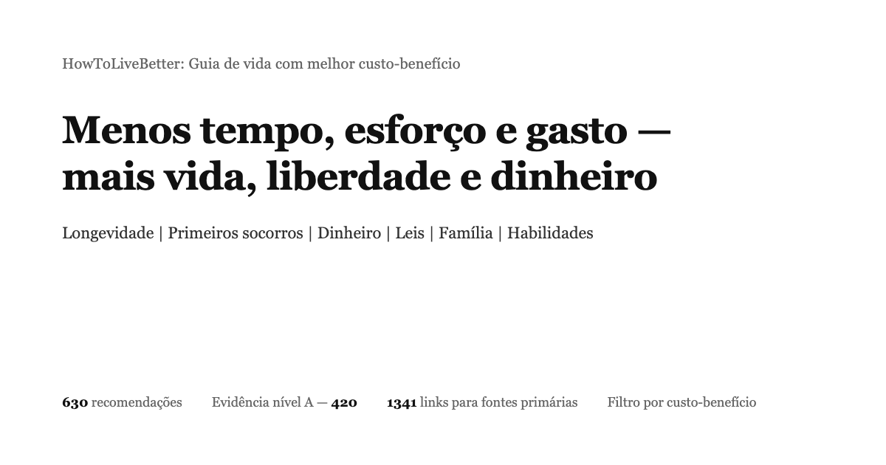

# HowToLiveBetter: Guia de vida com melhor custo-benefício — tradução em português brasileiro

Cobre longevidade e prevenção de doenças, acidentes e primeiros socorros, economizar e administrar dinheiro, fraudes e linhas vermelhas legais, rede de segurança no desemprego, riscos de empreender, montar uma plataforma dentro da lei, amor, casamento e filhos, viagens ao exterior e habilidades. 
630 recomendações; cada uma diz o que custa, o que devolve e o grau de evidência. As fontes citam só artigos de periódicos e documentos oficiais.

Você não precisa fazer tudo: é uma lista ordenada por retorno, não uma lista de tarefas — uma ou duas já contam. O autor também não fez a maior parte.

**[Abrir a página de busca online](https://dlgrv.github.io/HowToLiveBetter/pt/)** · [Índice](#índice) · [Glossário](#como-ler-os-números-glossário) · [Registros de verificação](docs/research/核实记录/) · [Vale a pena casar (texto longo)](docs/research/pt/Is-Marriage-Worth-It.md) · [Kit de emergência doméstico (texto longo)](docs/research/pt/Home-Emergency-Kit.md) · [Devo parar para ajudar um estranho (texto longo)](docs/research/pt/Should-You-Stop-To-Help-A-Stranger.md) · [Quais licenças uma plataforma precisa (texto longo)](docs/research/pt/What-Licenses-A-Platform-Needs.md)

Idiomas:

- [🇧🇷 Português](README.pt.md) - [ler no site](https://dlgrv.github.io/HowToLiveBetter/pt/)
- [🇬🇧 English](README.md) - [read on the site](https://dlgrv.github.io/HowToLiveBetter/en/)
- [🇷🇺 Русский](README.ru.md) - [читать на сайте](https://dlgrv.github.io/HowToLiveBetter/ru/)
- [🇨🇳 中文](README.zh.md) - [在网站阅读](https://dlgrv.github.io/HowToLiveBetter/zh/)
- [🇪🇸 Español](README.es.md) - [leer en el sitio](https://dlgrv.github.io/HowToLiveBetter/es/)

---

## Perguntas que este livro tenta responder

Use a [página de busca online](https://dlgrv.github.io/HowToLiveBetter/pt/) para filtrar por palavra-chave, seção e grau de evidência. Os capítulos em português aparecem no índice abaixo conforme forem publicados em [book/pt/](book/pt/).

## Como ler

- **Para filtrar por condições**: abra a [página de busca online](https://dlgrv.github.io/HowToLiveBetter/pt/); você pode combinar três dimensões de custo — dinheiro, tempo e força de vontade.
- **Para ler em ordem**: dentro de cada seção, os itens vão do maior para o menor custo-benefício.
- **Se os números assustam**: cada item tem uma linha «Em linguagem simples» que traduz riscos e intervalos do campo Benefício para o dia a dia, sem inventar números novos.

## Quatro recursos

Este guia otimiza quatro recursos, não só a expectativa de vida:

- **Vida**: viver mais tempo e morrer menos por causas evitáveis
- **Tempo e energia**: menos atividades sem retorno e menos desgaste diário
- **Dinheiro**: gastar menos em coisas que não pagam e colocar onde o retorno é claro
- **Liberdade pessoal**: não cruzar uma linha vermelha por desconhecimento e acabar preso ou processado

## Graus de evidência

| Grau | Significado |
| --- | --- |
| A | Evidência quantificável de metanálises, grandes coortes ou ECRs, com números concretos |
| B | Há pesquisa, mas difícil quantificar, ou amostra pequena / estudo único |
| C | Experiência do autor ou consenso geral, sem literatura direta |

Dos 630 itens do livro, 420 são grau A, 159 grau B e 51 grau C; 58 estão marcados como controversos e 35 como TODO, pendentes de verificação.

## Como ler os números (glossário)

O texto tenta falar de forma direta, mas citar pesquisa exige alguns termos estatísticos. Na [página de busca online](https://dlgrv.github.io/HowToLiveBetter/pt/), passe o mouse (ou toque) em palavras sublinhadas para ver explicações curtas.

## Índice

1. [Não morra cedo](book/pt/01-Como-Evitar-Uma-Morte-Prematura.md)
2. [Não morra devagar](book/pt/02-Não-Morra-Devagar.md)
3. Não desperdice energia
4. Não desperdice tempo
5. Não desperdice dinheiro
6. Lista negativa
7. Como viver sem dinheiro
8. Não se enrole: lei e patrimônio
9. Linhas vermelhas legais para pessoas comuns
10. Namoro e casamento valem a pena?
11. Linhas vermelhas para programadores e técnicos
12. Empreender e fazer negócios
13. Emergências: o que fazer primeiro
14. Contas e segurança da informação
15. Alugar e comprar moradia
16. Viver com doença crônica
17. Idosos em casa
18. Ter filhos vale a pena?
19. Emprego e acidente de trabalho
20. Recém-nascido
21. Viagens e segurança no exterior
22. Como relaxar
23. Quais habilidades aprender
24. Ir ao médico
25. Depois que alguém morre
26. Criar um site ou plataforma
27. Gravidez e parto
28. Não estrague a saúde pela aparência
29. Depois de um golpe forte
30. Filhos em idade escolar
31. Caminhos depois dos dezoito
32. Estudar no exterior
33. Como viver depois de uma deficiência
34. Remédios caseiros sem se machucar

Textos longos: [Kit de emergência doméstico](docs/research/pt/Home-Emergency-Kit.md), [Quais licenças uma plataforma precisa](docs/research/pt/What-Licenses-A-Platform-Needs.md), [Vale a pena casar](docs/research/pt/Is-Marriage-Worth-It.md), [Devo parar para ajudar um estranho](docs/research/pt/Should-You-Stop-To-Help-A-Stranger.md). O rastro de verificação das fontes está em [docs/核实记录](docs/research/核实记录/).

`site/index.html` é o modelo da busca online; `make web-build` gera páginas em `site/{en,ru,es,zh,pt}/`. Localmente: `make serve` e abra http://127.0.0.1:8000/pt/.

## O livro em si

O texto está dividido em 2 arquivos de seção em [book/pt/](book/pt/); clique nos títulos do índice quando os arquivos existirem. A divisão evita o limite de 512 KB de renderização do GitHub em um único arquivo; a [busca online](https://dlgrv.github.io/HowToLiveBetter/pt/) lê os arquivos combinados da mesma forma.
