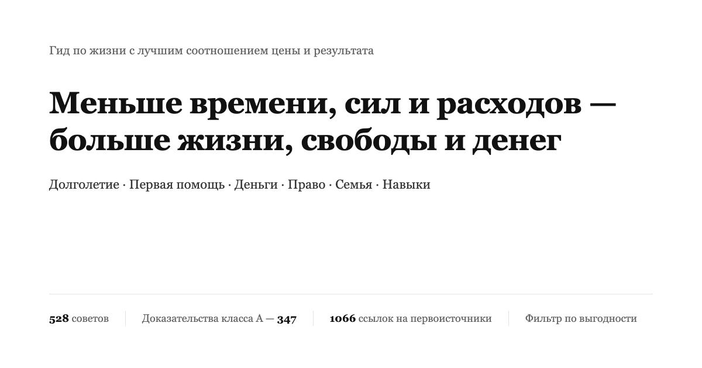

<div align="center">



# Гид по жизни с лучшим соотношением цены и результата

Охватывает долголетие и профилактику болезней, несчастные случаи и первую помощь, экономию и управление деньгами, защиту от мошенников и юридические красные линии, подушку на случай безработицы, риски своего дела, запуск площадки и её легальность, любовь, брак и детей, выезд за границу и навыки.<br>
528 пунктов, в каждом написано, что тратится, что взамен и насколько твёрдые доказательства; источники — только журнальные статьи и официальные документы.

[](https://eternity4719.github.io/HowToLiveBetter/)
[](#оглавление)
[](#уровни-доказательности)
[](docs/核实记录/)
[](LICENSE)

**[Открыть страницу онлайн-поиска](https://eternity4719.github.io/HowToLiveBetter/)** · [Оглавление](#оглавление) · [Глоссарий](#как-читать-цифры-глоссарий) · [Записи проверки](docs/核实记录/) · [Выгоден ли брак](docs/ru/结婚划不划算.md) · [Домашний аварийный комплект](docs/ru/家庭应急装备清单.md) · [Стоит ли останавливаться, если с незнакомцем случилась беда](docs/ru/遇到陌生人出事该不该停.md) · [Какие документы нужны для запуска площадки](docs/ru/做平台要办哪些证.md)

</div>

**Языки / Languages:**
- 🇷🇺 [Русский](README.ru.md) → [сайт](https://dlgrv.github.io/HowToLiveBetter/ru/)
- 🇬🇧 [English](README.md) → [site](https://dlgrv.github.io/HowToLiveBetter/en/)
- 🇨🇳 [中文](README.zh.md) → [сайт](https://dlgrv.github.io/HowToLiveBetter/zh/)

---

## Вопросы, на которые хочет ответить эта книга

| Вопрос | Где посмотреть |
| --- | --- |
| Что можно делать почти бесплатно и при этом заметно снизить вероятность ранней смерти? | [1. Не умирайте рано](book/ru/01-Не-умирайте-рано.md) |
| Сколько именно лет жизни отнимают курение, алкоголь, сидячий образ жизни и недосып? | [2. Не умирайте медленно](book/ru/02-Не-умирайте-медленно.md) |
| Сил на день не хватает, всё время что-то отвлекает — как это исправить? | [3. Не тратьте силы зря](book/ru/03-Не-тратьте-силы-зря.md) |
| Куда уходит время и как делать меньше бесполезного? | [4. Не тратьте время впустую](book/ru/04-Не-тратьте-время-впустую.md) |
| Как распорядиться накопленным, чтобы проценты, комиссии и мошенники не съели сбережения? | [5. Не тратьте деньги впустую](book/ru/05-Не-тратьте-деньги-впустую.md) |
| Какие БАДы, чек-апы и прочие «налоги на доверчивость» можно вообще не покупать? | [6. Анти-список](book/ru/06-Анти-список.md) |
| Потерял работу, ждёшь зарплату, денег нет — что можно получить и куда обращаться? | [7. Как жить без денег](book/ru/07-Как-жить-без-денег.md) |
| Выкуп за невесту (цайли, 彩礼), квартира, купленная до брака, крупные переводы денег в период отношений — кому это принадлежит по закону? | [8. Не подставляйтесь](book/ru/08-Не-подставляйтесь.md) |
| На вас заявили в полицию, кто-то написал донос на лживых основаниях — что делать в первый момент и можно ли потом добиться возмещения? | [8. Не подставляйтесь](book/ru/08-Не-подставляйтесь.md) |
| Какие «подработки» и мелкие услуги превращают обычного человека в обвиняемого по уголовному делу? | [9. Юридические красные линии](book/ru/09-Юридические-красные-линии.md) |
| Добиваться многих сразу или вкладываться в одного, есть ли шанс у любви на расстоянии, что взять с собой в загс? | [10. Окупается ли брак](book/ru/10-Окупается-ли-брак.md) |
| За какой код и какие заказы можно получить реальный срок? | [11. Красные линии для технарей](book/ru/11-Красные-линии-для-технарей.md) |
| Что продумать до того, как брать кредит на магазин или регистрировать компанию? | [12. Своё дело](book/ru/12-Своё-дело.md) |
| Человек лежит без дыхания, сильное кровотечение, пожар, заблудились — что делать сначала? | [13. Экстренные случаи](book/ru/13-Экстренные-случаи.md) |
| Аккаунт взломали, телефон потерян — с чего начать? | [14. Аккаунты и безопасность](book/ru/14-Аккаунты-и-безопасность.md) |
| Удержали депозит, выселяют, арендный бизнес рухнул — что делать? | [15. Аренда и покупка жилья](book/ru/15-Аренда-и-покупка-жилья.md) |
| Поставлен диагноз хронической болезни — как жить с ней дальше и тратить меньше? | [16. Жизнь с хронической болезнью](book/ru/16-Жизнь-с-хронической-болезнью.md) |
| Опека над пожилыми, завещание, деньги — как всё устроить заранее? | [17. Пожилые в семье](book/ru/17-Пожилые-в-семье.md) |
| Что выплачивают на ребёнка и сколько времени и денег он съедает? | [18. Окупаются ли дети](book/ru/18-Окупаются-ли-дети.md) |
| Как считаются сверхурочные и отпуск, сколько выплат при сокращении, как оформляют травму на производстве и получить деньги? | [19. Работа и травмы](book/ru/19-Работа-и-травмы.md) |
| Ребёнок только родился — какие дела самые срочные? | [20. Новорождённый](book/ru/20-Новорождённый.md) |
| В какие страны сейчас лучше не ехать и до чего дотягивается консульская помощь? | [21. Заграница](book/ru/21-Заграница-и-безопасность.md) |
| Как не нарваться в караоке, интернете-кафе, квест-комнате и что лучше всего снимает стресс? | [22. Как расслабляться](book/ru/22-Отдых-и-снятие-стресса.md) |
| Электросварка, английский, сертификаты — что из этого реально окупается? | [23. Выгодные навыки](book/ru/23-Какую-профессию-учить.md) |
| Одно и то же заболевание в поликлинике и в больнице третьего уровня — на сколько различается цена? | [24. Как ходить к врачам](book/ru/24-У-врача.md) |
| Привезли тяжёлого в больницу: идти в окошко регистрации или в приёмное отделение? После лечения — нужна ли экспертиза инвалидности и справка? | [24. Как ходить к врачам](book/ru/24-У-врача.md) |
| Близкий человек умер: что делать в первые часы, какие деньги можно вернуть и какие платежи не платить? | [25. После смерти близкого](book/ru/25-После-смерти-человека.md) |
| Делаешь сайт или площадку с оплатой: какие документы нужны и где размещать сервер? | [26. Сайт или платформа](book/ru/26-Сайт-или-платформа.md) |
| Беременность и роды: что и когда делать, какие документы оформить до выписки? | [27. Беременность и роды](book/ru/27-Беременность-и-роды.md) |
| Хочу похудеть или стать красивее — что из «улучшений» ломает здоровье? | [28. Не губите тело ради внешности](book/ru/28-Не-ломайте-здоровье-ради-внешности.md) |
| Близкий умер, сократили, поставлен тяжёлый диагноз — что важнее всего в первые месяцы? | [29. После тяжёлого удара](book/ru/29-После-тяжёлого-удара.md) |
| Ребёнок пошёл в школу — какие вещи со здоровьем и психикой нельзя откладывать до экзаменов? | [30. Ребёнок в школе](book/ru/30-Ребёнок-в-школе.md) |
| После восемнадцати кроме учёбы и подработки есть ещё пути — какие у каждого входные требования? | [31. Пути после 18](book/ru/31-Дороги-после-восемнадцати.md) |

## Как читать

- **Хочу отфильтровать по условиям**: откройте [страницу онлайн-поиска](https://eternity4719.github.io/HowToLiveBetter/) — там можно комбинировать поиск по ключевым словам, главам и уровню доказательности, а также по трём измерениям стоимости: «тратятся ли деньги, сколько времени, нужна ли сила воли». Данные читаются напрямую из файлов book/, правите текст — обновляется и поиск.
- **Хочу читать подряд**: внутри каждого раздела пункты отсортированы по убыванию соотношения «результат/затраты» — начинайте с первых пунктов каждого раздела.
- **Не понимаю строку с цифрами**: у каждого пункта есть строка «Простыми словами», которая переводит цифры из графы «Эффект» — «отношение рисков», «доверительный интервал» — на человеческий язык вида «за тот же период вероятность смерти ниже примерно на 20%» или «несколько суток задержания и штраф столько-то». Она использует только факты из оригинала и не добавляет новых чисел. Для решения достаточно этой одной строки; в графе «Эффект» остаются все исходные цифры и интервалы, чтобы вы могли проверить сами.
- **Хочу только самые твёрдые выводы**: отметьте на странице поиска уровень доказательности A — останутся 347 пунктов с конкретными цифрами, из метаанализов или крупных исследований.
- **Хочу только самое выгодное**: отметьте «Очень высокая» по соотношению «результат/затраты» — получите 99 пунктов, которые не требуют ни денег, ни времени, ни силы воли, и при этом дают максимальный результат. Добавьте сверху одно «что взамен» — получится приоритетный список в этой системе отсчёта.
- **Не пугайтесь заголовков разделов со словом «Не»**: заголовок раздела описывает результат, который этот раздел помогает предотвратить («Не умирайте рано», «Не тратьте время впустую»), а не запреты: не всё внутри — запреты. Действие формулирует заголовок пункта, и он всегда начинается с глагола, который сам говорит, что делать или чего не делать — в одном разделе встречаются и то и другое: например, в разделе 4 есть и «Записывайте „планирую сделать“ как „в котором часу, где, при чём делаю“», и «Не смотрите телевизор и бегущие новости». Читайте заголовки пунктов, а не подстраивайтесь под интонацию заголовка раздела.

Каждый пункт выглядит так:

```markdown
### 5. Замените дома обычную соль на соль с пониженным содержанием натрия (калиевую соль)
- Стоимость: каждый пакет дороже на несколько юаней
- Простыми словами: В рандомизированном исследовании 20 тысяч человек у тех, кто дома заменил обычную соль на соль с пониженным содержанием натрия, вероятность смерти в течение пяти лет была ниже примерно на 12%, инсульта — примерно на 14%. Это результат случайного распределения по группам, он убедительнее обычных наблюдательных данных.
- Эффект: инсульт снижается на 14%, сердечно-сосудистые события — на 13%, общая смертность — на 12%
- Уровень доказательности: A
- Источники: Neal B, et al. (2021). NEJM. https://doi.org/10.1056/NEJMoa2105675
- Примечания: Спорный пункт. При почечной недостаточности и тем, кто принимает калийсберегающие диуретики, не применять. Есть ещё одно исследование, охватившее 181 страну: оно обнаружило, что в странах с более высоким потреблением натрия ожидаемая продолжительность жизни, наоборот, выше, а общая смертность ниже (β=−131 случаев на грамм ежедневного потребления натрия, R²=0.60, P<0.001); авторы на этом основании возражают против того, чтобы считать натрий главным виновником сокращения жизни; но экологическое исследование сравнивает страны, а не людей: богатые страны едят больше соли и при этом живут дольше, нельзя исключить смешивающий фактор уровня экономики, и уровень доказательности ниже, чем у приведённого выше рандомизированного контролируемого исследования. Источники: Messerli FH, Hofstetter L, Syrogiannouli L, et al. (2021). Sodium intake, life expectancy, and all-cause mortality. European Heart Journal, 42(21), 2103-2112. <https://doi.org/10.1093/eurheartj/ehaa947>
```

## Четыре вида ресурсов

Этот гид оптимизирует не только продолжительность жизни, а четыре вида ресурсов:

- **Продолжительность жизни**: жить дольше и реже умирать от того, чего можно было избежать
- **Время и силы**: чтобы время жизни не съедали дела без результата, а внимание и физические силы не расходовались впустую
- **Деньги**: меньше переплачивать и вкладывать там, где результат гарантирован
- **Личная свобода**: не оказаться в административном задержании или СИЗО лишь потому, что не знал одной красной линии

Каждый пункт отвечает на два вопроса: что тратится (деньги / время / силы / сила воли) и что взамен (изменение общей смертности / снижение конкретной причины смерти / экономия времени и сил / экономия денег / защита и личная свобода). Пункты упорядочены по соотношению «результат/затраты», а не по категориям: при близкой стоимости впереди те, у кого результат больше.

**На кого засчитывается результат — вопрос уровней.** По убыванию ожидания того, что эта польза когда-нибудь вернётся к вам: ① **вы сами**; ② **супруг(а) и прямые родственники** (родители, дети, бабушки и дедушки, внуки); ③ **друзья, коллеги и другие родственники** — взаимные отношения: помогли сейчас, вернётся потом; ④ **незнакомцы** — самый нижний уровень, но не ноль: вероятность ответной реакции мала, характер человека вам неизвестен, а вдобавок есть риск, что вас обманут, обвинят или станут мстить. Уровни между собой не складываются; на уровне ④ польза и риски описываются вместе.

Раздел о первой помощи читайте с этим в уме: в Китае из 38,227 случаев остановки сердца вне больницы 79.2% случаются дома — учиться непрямому массажу сердца стоит прежде всего ради своих близких; правила вроде «увидел, что человек тонет, — сам в воду не лезь» или «наткнулся на драку — не пытайся разнимать руками» — это правила самосохранения, они защищают вас от превращения из наблюдателя во вторую жертву.

Числа о смертности, числа о времени и силах, числа о деньгах и юридические последствия считаются в разных системах отсчёта и между собой не пересчитываются. Эти четыре вида ресурсов соответствуют четырём вариантам «что взамен» на странице поиска; между собой они не сравниваются.

## Уровни доказательности

У каждого пункта отмечен уровень доказательности:

| Уровень | Значение |
| --- | --- |
| A | Есть измеримые доказательства — из метаанализов, крупных когорт или РКИ, позволяющие назвать конкретные числа (HR, RR, процент снижения) |
| B | Исследования есть, но количественно оценить трудно, либо доказательства из малых выборок или отдельных работ |
| C | Опыт автора или общепринятое мнение; прямой литературы нет |

Из всех 528 пунктов книги 347 имеют уровень A, 131 — уровень B и 50 — уровень C; кроме того, у 47 пунктов отмечено «спорно», а в 39 местах стоит пометка «TODO: проверить». У оспариваемых пунктов уровней A/B стоит пометка «спорно» и приведены аргументы противоположной стороны. Источники — только первоисточники (журнальные статьи с DOI или ссылкой PubMed либо отчёты официальных организаций: ВОЗ, CDC, государственное статистическое бюро и т.п.); пересказы из вторых рук не цитируются. Ненадёжные числа помечаются «TODO: проверить».

## Уровни выгоды

Уровень доказательности отвечает на вопрос «можно ли верить этой цифре», но не на вопрос «стоит ли это делать». Поэтому у каждого пункта, кроме того, отмечены порядок величины результата и система отсчёта; страница поиска по ним вместе с тремя видами стоимости вычисляет уровень выгоды:

| Измерение | Значения | Как определяется |
| --- | --- | --- |
| Система отсчёта | годы жизни / деньги / время и силы / личная свобода | По тому, что этот пункт главным образом возвращает. **Между разными системами отсчёта сравнения нет**: «снижение общей смертности на 12%» и «экономия 500 юаней в год» лежат не на одной шкале |
| Порядок результата | большой / средний / малый | По возможности механически, по пороговым значениям из графы «Эффект» самого пункта: для лет жизни смотрят относительное снижение (большой — при ≥20%, средний — при 10–20%, малый — при <10% либо если есть только замещающие показатели); для денег смотрят сумму (десятки тысяч юаней и выше — большой, от нескольких сотен до нескольких тысяч — средний, десятки юаней — малый); для личной свободы смотрят последствие (избежание уголовной ответственности — большой, избежание административного задержания или штрафа — средний, избежание гражданского спора — малый); для времени и сил смотрят объём сэкономленного (часы в день — большой, часы в неделю — средний, разовое — малый) |
| Соотношение «результат/затраты» | очень высокое / высокое / обычное | Результат большой и все три вида стоимости нулевые = очень высокое; результат большой и затраты невысоки либо результат средний и затраты нулевые = высокое; остальное = обычное |

Из всех 528 пунктов книги: очень высокое соотношение у 100 пунктов (19%), высокое — у 256 (48%), обычное — у 172 (33%). Утолщение среднего уровня сделано намеренно: в основе лежит лишь трёхуровневая оценка порядка результата, а более мелкое деление было бы притворной точностью.

**Этот уровень — суждение автора, а не доказательство**: по сути это уровень C, ортогональный уровню доказательности. Бывает пункт уровня A с обычным соотношением (у вакцины против опоясывающего лишая в III фазе РКИ эффективность 97.2%, но две дозы стоят три-четыре тысячи юаней, а опоясывающий лишай редко приводит к смерти), и бывает пункт уровня C с очень высоким соотношением (перед выездом за границу отправить маршрут близким). «Обычное» не значит «не стоит делать» — все пункты книги рекомендованы к выполнению; просто здесь цену затрат нужно взвешивать самому.

## Как читать цифры (глоссарий)

В самом тексте книга старается говорить по-человечески, но при цитировании исследований не обойтись без нескольких статистических терминов. Если что-то непонятно — смотрите таблицу; на странице онлайн-поиска пояснение всплывает при наведении (или нажатии) на слово с пунктирным подчёркиванием.

<details>
<summary>Развернуть 41 термин (общая смертность, HR, RR, 95% ДИ, метаанализ, BMI, LPR, задаток и аванс…)</summary>

| Термин | Значение |
| --- | --- |
| Общая смертность | Доля умерших от любых причин за период, без разделения по причинам. Книга использует её как меру «долго ли живут». В первоисточниках — «смертность от всех причин», английское сокращение ACM |
| HR | Отношение рисков (hazard ratio). Скорость, с которой в двух группах за одно и то же время наступает событие (смерть, болезнь). HR 0.87 — на 13% ниже контрольной группы, HR 1.21 — на 21% выше |
| RR | Относительный риск (relative risk). Отношение вероятностей события в двух группах; читается как HR |
| OR | Отношение шансов (odds ratio). Отношение «шансов» события в двух группах; при редких событиях близко к RR, при частых преувеличивает различия |
| IRR | Отношение показателей заболеваемости; читается как RR |
| RaR | Отношение числа событий (например, числа падений); читается как RR |
| Стандартизованное отношение смертности | SMR. Фактическое число умерших в группе, делённое на ожидаемое число, рассчитанное по коэффициентам смертности обычных людей того же возраста. 5.86 означает, что смертей в 5.86 раза больше, чем у сверстников |
| Разница рисков | Вероятности события в двух группах вычитаются, сразу видно «сколько лишних случаев на тысячу человек». Отношение говорит только «во сколько раз», разница рисков — на сколько человек абсолютно больше |
| 95% ДИ | 95%-й доверительный интервал — диапазон, внутри которого с большой вероятностью лежит истинное значение. Если интервал для отношения переходит через 1, а для разности — через 0, различие может оказаться случайным; в тексте тогда пишут «статистически незначимо» |
| RCT (РКИ) | Рандомизированное контролируемое испытание. Людей случайно делят на две группы: одна получает вмешательство, другая нет — и сравнивают результат. Лучше всего показывает причинность |
| Метаанализ | Объединённая статистическая обработка результатов нескольких исследований, дающая одну общую оценку. Называется также meta-анализом |
| Когорта | Когортное исследование. Группу людей наблюдают годами и смотрят, у кого что случилось. Показывает связь, но не доказывает причинность полностью |
| Наблюдательное | Наблюдательное исследование. Исследователи только наблюдают, не вмешиваясь; на результат могут влиять смешивающие факторы и обратная причинность, к цифрам нужна скидка |
| Смешивающие факторы | Третий фактор одновременно влияет и на причину, и на следствие, и связь выглядит как причинность. Кто ест больше овощей, обычно и больше двигается |
| Обратная причинность | Не A вызывает B, а B вызывает A. Не долгий сон приводит к ранней смерти, а тяжелобольные дольше спят |
| d, g | Величина эффекта. На сколько стандартных отклонений различаются средние двух групп. 0.2 — малое, 0.5 — среднее, 0.8 — большое |
| r | Коэффициент корреляции. Насколько согласованно меняются две величины, от −1 до 1: 0.1 — слабая, 0.3 — средняя, 0.5 — сильная |
| MET | Единица интенсивности нагрузки. 1 MET — спокойное сидение, быстрая ходьба — примерно 3–4 MET. MET·ч — интенсивность, умноженная на часы |
| GRADE | Международный стандарт оценки качества доказательств; четыре ступени: высокая, средняя, низкая, очень низкая |
| Анализ по приглашению | Эффект считается по тем, «кого пригласили на скрининг», а не по тем, «кто реально прошёл»; такой подсчёт занижает пользу скрининга для тех, кто его реально прошёл |
| Пачка-лет | Единица курительного стажа: число пачек в день, умноженное на число лет курения. 30 пачка-лет — пачка в день на протяжении 30 лет |
| BMI | Индекс массы тела: вес (кг) поделить на квадрат роста (м) |
| LDL | Холестерин липопротеинов низкой плотности, в просторечии «плохой» холестерин |
| eGFR | Расчётная скорость клубочковой фильтрации — показатель фильтрующей способности почек, единица mL/min/1.73 м²; чем ниже, тем хуже функция почек; по нему стадируют хроническую болезнь почек |
| HBsAg | Поверхностный антиген гепатита B; положительный результат означает, что человек инфицирован вирусом гепатита B |
| HPV | Вирус папилломы человека; некоторые его типы при длительном инфицировании приводят к раку шейки матки |
| LDCT | Низкодозная компьютерная томография грудной клетки; доза облучения примерно в 5–10 раз меньше, чем у обычного КТ |
| PM2.5 | Твёрдые частицы в воздухе диаметром до 2.5 микрометра |
| NOVA | Классификация продуктов по степени обработки; «ультрапереработанные продукты» — её четвёртая категория |
| LPR | Ставка по кредитам на кредитном рынке (loan prime rate, 贷款市场报价利率). Базовая кредитная ставка в Китае, публикуется 20-го числа каждого месяца; от неё отсчитывают и ипотечные ставки, и потолок ставок частных займов |
| Трудовой арбитраж: решение окончательно (一裁终局) | Решение трудового арбитража вступает в силу сразу, и работодатель больше не может оспорить его в суде |
| Грубые коэффициенты брака и развода | Сколько браков и разводов на тысячу человек зарегистрировано за год (粗结婚率、粗离婚率). Число разводов, делённое на число браков, — другая мера, «коэффициент разводов к бракам» (离结比); их нельзя смешивать |
| AED | Автоматический наружный дефибриллятор. Привычные красные или жёлтые ящики первой помощи в общественных местах: включите — и следуйте голосовым подсказкам, прибор сам решит, нужен ли разряд |
| CPR | Сердечно-лёгочная реанимация. При остановке сердца сильно давить на грудную клетку, чтобы кровь продолжала циркулировать |
| Сертификация 3C | Обязательная сертификация продукции в Китае (3C 认证). Продукция из каталога без этого знака не может сходить с конвейера и продаваться |
| Регистрация ICP | Процедура, при которой сайт или приложение до запуска регистрируется в системе Министерства промышленности и информатизации (ICP 备案) |
| Категорирование защиты информации (等级保护) | Система категорирования защиты информации: системы делятся на категории по значимости, для каждой обязательны свои меры защиты |
| GPL | Лицензия открытого исходного кода: если сделать из кода под GPL продукт, при распространении обычно придётся открыть и его исходники |
| Соглашение о неконкуренции (竞业限制) | После увольнения в течение оговорённого срока не работать у конкурента; компания обязана платить ежемесячную компенсацию, максимум 2 года |
| Заявленный вклад в уставный капитал (认缴出资) | Деньги, которые вы обещали внести при регистрации компании. Пообещал — обязан в установленный срок внести фактически, это не запись для красоты |
| Задаток и аванс | У задатка (定金) есть штрафная функция: получившая сторона при нарушении возвращает вдвое, максимум 20% суммы договора; аванс (订金) — просто предоплата, без штрафных последствий |
| Дибао (低保) | Госпрограмма гарантированного минимального дохода в КНР: семьям с доходом ниже местной «черты дибао» платят пособие. Порог и сумма устанавливаются каждым городом самостоятельно, поэтому «дибао» в книге — всегда местная величина |
| Хукоу (户口) | Прописка / семейный регистрационный учёт в КНР. Привязывает человека к конкретному месту: от хукоу зависят соцвыплаты, школа для детей, право подать заявление на пособие |
| Соцстрах «пять видов» (五险) | Пакет обязательных взносов работодателя в КНР: пенсионное, медицинское, от безработицы, от производственных травм, материнство. Взносы идут и с работника, и с работодателя |

</details>

## Оглавление

1. [Не умирайте рано](book/ru/01-Не-умирайте-рано.md): смерть от внешних причин, газ и отравления, вакцинация, скрининг, психологический кризис и масштаб времени у суицидальных мыслей, что остаётся после «спасли», год после тяжёлого падения, расчёт продажи почки, домашний аварийный комплект, сигналы, которые стоит проверить (в том числе видимая кровь в моче). Система отсчёта: общая смертность или конкретная причина смерти.
2. [Не умирайте медленно](book/ru/02-Не-умирайте-медленно.md): табак и алкоголь, движение, сон, питание, сидячий образ жизни. Система отсчёта: общая смертность или конкретная причина смерти.
3. [Не тратьте силы зря](book/ru/03-Не-тратьте-силы-зря.md): сон, отвлечения, многозадачность, усталость от решений, долги в отношениях с людьми, чего ждать при общении с госорганами. Система отсчёта: силы/время.
4. [Не тратьте время впустую](book/ru/04-Не-тратьте-время-впустую.md): дела без результата, невозвратные затраты, прокрастинация, встречи, дорога на работу и с работы. Система отсчёта: время.
5. [Не тратьте деньги впустую](book/ru/05-Не-тратьте-деньги-впустую.md): подписки, лотереи, проценты, страхование, комиссии фондов, личные пенсионные накопления, автострахование, предоплата, продажи в прямом эфире, индивидуальный счёт медицинской страховки (医保), обман детей и возврат платежей в играх. Система отсчёта: деньги.
6. [Анти-список](book/ru/06-Анти-список.md): то, что выглядит выгодным, но на деле им не является.
7. [Как жить без денег](book/ru/07-Как-жить-без-денег.md): пособия и субсидии, поиск подработки, ночлег и еда, медицина, борьба за невыплаченную зарплату, как не попасть в ловушку. Система отсчёта: деньги/социальная защита.
8. [Не подставляйтесь](book/ru/08-Не-подставляйтесь.md): ДТП, блокировка платежа при мошенничестве, дипфейки с лицом и голосом на базе ИИ, средства защиты после обвинения или ложного доноса, граница между вымогательством «заплачу — или донесу» и законным требованием возмещения, конфликт и экстремальное насилие «на эмоциях», импульс к насилию и право близких вызвать врачей, что делать после травли в сети через платформу и судебные запреты, выкуп за невесту (彩礼), имущество до брака, поручительство, страхование родственника с последующим вредом — четыре юридических барьера, анти-мошенничество, сроки исковой давности, исполнение и «список недобросовестных», ответственность владельца собаки. Система отсчёта: деньги/личная свобода.
9. [Юридические красные линии](book/ru/09-Юридические-красные-линии.md): слухи, оскорбление героев и мучеников, за рубежом смотреть можно — перепубликовывать нельзя, распространение порнографии, «подработка» по отмыванию денег, поддельные документы для получения кредита, выброс предметов с высоты, стволы-муляжи, дроны, скрытая съёмка, законная передача ребёнка, когда его не можешь растить, и граница с торговлей людьми и оставлением в опасности, азартные игры, мясо диких животных, продажа органов и посредничество с донорами. Система отсчёта: личная свобода/деньги.
10. [Окупается ли брак](book/ru/10-Окупается-ли-брак.md): стратегия поиска спутника, красная линия навязчивости, сигналы заинтересованности, качество отношений, любовь на расстоянии, процедура регистрации, добрачное медицинское обследование, счёт здоровья, счёт времени, счёт денег, квартира от родителей и общие долги супругов, цена выхода. Длинная статья: [Выгоден ли брак](docs/ru/结婚划不划算.md).
11. [Красные линии для технарей](book/ru/11-Красные-линии-для-технарей.md): читы, краулеры, скрипты скупки билетов, удаление базы, унос исходников, разработка на заказ, неконкуренция, лицензии открытого кода, регистрация сайтов. Система отсчёта: личная свобода/деньги.
12. [Своё дело](book/ru/12-Своё-дело.md): стартовый капитал, поручительство, выбор организационной формы, регистрация, лицензии, налоговая отчётность, счета-фактуры, налоговое мошенничество, договоры, найм людей, серийное производство, красные линии по интеллектуальной собственности при закупках и использовании изображений, выход из дела. Система отсчёта: деньги/юридическая ответственность.
13. [Экстренные случаи](book/ru/13-Экстренные-случаи.md): остановка сердца, инсульт и инсульт задней циркуляции, глазной инсульт, инфаркт, расслоение аорты, «громоподобная» головная боль, хроническая субдуральная гематома, тромбоэмболия лёгочной артерии, сильное кровотечение, укусы, ожоги, анафилактический шок, эпилепсия, гипогликемия, поражение электротоком, угарный газ, случайный приём внутрь и химические ожоги, застрявшие в теле предметы, иммобилизация переломов, мошенничество, угрозы приватности, тепловой удар, пожар, утопление, потеря ориентирования, переохлаждение, укусы змей, землетрясение, дикие звери, удар молнии, горная болезнь, клещи, вода в походах; и «стоит ли спасать»: как поднимать упавшего старика, что делать, если наткнулся на драку, у кого искать деньги, если пострадал, спасая. Система отсчёта: выживание и деньги, последние пункты затрагивают и личную свободу.
14. [Аккаунты и безопасность](book/ru/14-Аккаунты-и-безопасность.md): двухфакторная аутентификация, пароли, SIM-карта, потеря телефона, кража денег с банковской карты, устройства входа, разрешения приложений, распознавание лиц, право просматривать и удалять данные. Система отсчёта: деньги/персональные данные.
15. [Аренда и покупка жилья](book/ru/15-Аренда-и-покупка-жилья.md): залог, насильственное выселение, посредник, принимающий оплату, эскроу-счета, «купля-продажа не разрывает аренду», проверка прав на собственность, специальный счёт для денег по сделке, комнаты-перегородки. Система отсчёта: деньги.
16. [Жизнь с хронической болезнью](book/ru/16-Жизнь-с-хронической-болезнью.md): приверженность лечению, межрегиональный расчёт за амбулаторные хронические болезни, записи контрольных осмотров, не бросать лекарства ради народных средств, длительные рецепты, прикрепление к семейному врачу, скрининг осложнений, профилактика повторных почечных камней, целевая терапия подагры. Система отсчёта: общая смертность/деньги.
17. [Пожилые в семье](book/ru/17-Пожилые-в-семье.md): назначение опекуна по договору, формы завещаний, счета и мошеннические схемы, «инвестиции в пенсию» и «пенсия под залог квартиры» как обман, долгосрочное страхование ухода, профилактика пролежней у лежачих. Система отсчёта: деньги/личная свобода.
18. [Окупаются ли дети](book/ru/18-Окупаются-ли-дети.md): выплаты на детей, декретный отпуск и пособие по беременности и родам, защита в периоды беременности/декрета/кормления, счёт времени, счёт денег. Система отсчёта: деньги/время.
19. [Работа и травмы](book/ru/19-Работа-и-травмы.md): сверхурочные, ежегодный отпуск, испытательный срок; информирование о вредных факторах и три медосмотра, защита от пыли и шума; N, компенсация вместо предупреждения, 2N, не подписывать «увольнение по собственному», собирать доказательства; сроки обращения по производственной травме, если работодатель не платил взносы, экспертиза трудоспособности, выплаты при смерти на работе. Система отсчёта: деньги.
20. [Новорождённый](book/ru/20-Новорождённый.md): безопасный сон, первая прививка от гепатита B, прививки национального календаря, грудное молоко и прикорм, температура воды для смеси, мёд, витамин K, когда с температурой к врачу, не трясти, подгузники и крупные покупки. Система отсчёта: младенческая смертность/деньги.
21. [Заграница](book/ru/21-Заграница-и-безопасность.md): уровни предупреждений о безопасности, горячая линия 12308, границы консульской защиты, медицинская страховка за границей, обман «высокооплачиваемой работой за рубежом», потеря документов, иностранные права, регистрация у посредников. Система отсчёта: деньги/личная свобода.
22. [Как расслабляться](book/ru/22-Отдых-и-снятие-стресса.md): запасные выходы, цены без обмана, красные линии по наркотикам, что тебе предложил посторонний, регистрация по паспорту в интернете-кафе, выбор локации для квестов; движение, осознанность, дыхание, общение, зелёные зоны. Система отсчёта: деньги/личная свобода, а также силы/общая смертность.
23. [Выгодные навыки](book/ru/23-Какую-профессию-учить.md): учиться или работать (возрастная граница детского труда, образование и смертность, структура образования по стране, бесплатное обучение и стипендии-кредиты, путь из профучилищ в вузы, как посчитать это самому), отдача от образования, поддельные сертификаты, субсидии на обучение, умения, устойчивые к автоматизации, уровни квалификации, как найти дефицитные профессии. Система отсчёта: деньги/время, один пункт — про смертность.
24. [Как ходить к врачам](book/ru/24-У-врача.md): ступенчатая медицина и направления, непрерывный счёт франшизы, разница в доле возмещения, зарезервированные талоны, оценка необходимости лечения в другом регионе, хранение и опечатывание медкарт, четыре уровня сортировки в приёмном отделении, помощь при болезни, когда платить нечем, когда оформлять экспертизу инвалидности, как оформить удостоверение инвалида. Система отсчёта: деньги/время.
25. [После смерти близкого](book/ru/25-После-смерти-человека.md): заявление в полицию и свидетельство о смерти, перевозка тела и кремация, возражения против причины смерти и вскрытие, снятие с регистрационного учёта (прописки), базовый перечень ритуальных услуг, нарушения цен, регистрация у посредников, остаток на пенсионном счёте и социальные выплаты, права на персональные данные умершего. Система отсчёта: деньги.
26. [Сайт или платформа](book/ru/26-Сайт-или-платформа.md): красные линии расчётов по платежам, лицензии на прямые трансляции и аудиовидеоконтент, проверка контрагентов платформой и передача налоговых данных, управление контентом, регистрация по настоящему имени, несовершеннолетние, уведомление и удаление, вывоз данных за границу, выбор сервера. Система отсчёта: личная свобода/деньги. Длинная статья: [Какие документы нужны для запуска площадки](docs/ru/做平台要办哪些证.md).
27. [Беременность и роды](book/ru/27-Беременность-и-роды.md): фолиевая кислота, карточка беременности и бесплатные осмотры, скрининг трёх болезней и предотвращение передачи ребёнку, табак и алкоголь во время беременности, аспирин и гестационный диабет, сигналы «немедленно в больницу», что делать при отхождении вод, обезболивание родов, показания к кесареву сечению, страх материнства, медицинское свидетельство о рождении, скрининг новорождённых, страховка и прописка новорождённого, осмотр через 42 дня после родов. Система отсчёта: смертность и деньги.
28. [Не губите тело ради внешности](book/ru/28-Не-ломайте-здоровье-ради-внешности.md): экстремальные диеты и расстройства пищевого поведения, две лицензии эстетической медицины и врач-специалист, места инъекций лица, где слепота, продукты для похудения с запрещённым сибутрамином, анаболические стероиды, рецепты и контроль при приёме препаратов для похудения и половых гормонов, оценка образа своего тела. Система отсчёта: смертность (показатели здоровья), два пункта об эстетической медицине затрагивают и личную свободу.
29. [После тяжёлого удара](book/ru/29-После-тяжёлого-удара.md): сердечно-сосудистое окно первого месяца после утраты, первая неделя после тяжёлого диагноза, потеря работы, полгода после смерти супруга, утрата из-за самоубийства, дети, потерявшие родителя, куда обратиться, если горе застыло, чем заменить «того самого человека», если нет ни родни, ни друзей, дети, потерявшие родителя, к кому обратиться, если горе застыло, развод, горячие линии 12356 и 12355, не принимать необратимых решений в остром стрессе, почему «умру — и долги уйдут» не работает. Система отсчёта: общая смертность, два последних пункта — деньги.
30. [Ребёнок в школе](book/ru/30-Ребёнок-в-школе.md): острые состояния, где счёт на часы, не откладывать лечение ради экзаменов, что делать при травле, два часа на улице каждый день, школьная карта здоровья, скрининг депрессии у подростков, продукты «лечащие близорукость», жёсткие правила сна и домашних заданий, академический отпуск с сохранением места, расширение зрачка при подборе очков и контроль, герметизация фиссур. Система отсчёта: смертность и показатели здоровья, плюс один-два пункта про деньги и время.
31. [Пути после 18](book/ru/31-Дороги-после-восемнадцати.md): законные требования восьми путей; армия (воинский учёт, два года срочной службы, совместные санкции за отказ от службы, компенсация учёбы и поступление, распределение и явка в 30 дней, пенсионные выплаты военнослужащим и налоги на стаж); целевой набор на проекты базовой службы; переход в штат для учителей после программы особых назначений; пожарные и гражданские служащие в армии; самообразование, взрослое образование и открытый университет; соцстрахование при гибкой занятости; страхование профвредностей курьеров. Система отсчёта: деньги/время, пункт об отказе от службы затрагивает и личную свободу.
32. [Учёба за границей: статус, подработка, страховка и признание диплома](book/ru/32-Учёба-за-границей.md): перед оплатой обучения проверьте список аккредитованных вузов (список Центра сервисной поддержки академического обмена — 认证院校名单); фиксированный срок пребывания F-1 в США с 15 сентября 2026 и 30-дневное окно на выезд; лимиты рабочего времени в США, Канаде, Великобритании и Австралии; очная учёба — основа статуса; сообщить новый адрес в США за 10 дней; предупреждения МИД КНР для выезжающих; австралийская OSHC не должна прерываться; британский медицинский сбор (776 £ в год для студентов); закладывайте 10–20 рабочих дней на признание диплома перед возвращением. Система отсчёта: деньги и личная свобода.

Внутри каждого раздела пункты идут по убыванию соотношения «результат/затраты». Заголовки разделов вроде «Не умирайте рано» или «Не тратьте время впустую» описывают результат, который раздел предотвращает; делать пункт или не делать — решайте по заголовку самого пункта. Длинные статьи см. также [Домашний аварийный комплект](docs/ru/家庭应急装备清单.md), [Какие документы нужны для запуска площадки](docs/ru/做平台要办哪些证.md), [Выгоден ли брак](docs/ru/结婚划不划算.md) и [Стоит ли останавливаться, если с незнакомцем случилась беда](docs/ru/遇到陌生人出事该不该停.md). Процесс проверки каждого источника записан в [Записи проверки](docs/核实记录/).

Файл `index.html` в корне репозитория — страница онлайн-поиска: фильтруйте пункты по ключевым словам, главам, уровню доказательности и трём измерениям стоимости (деньги, время, сила воли); данные она читает прямо из этого файла. Включите GitHub Pages в настройках репозитория (Deploy from a branch, ветка main, каталог /) — и страница станет доступна.

## Текст книги

Текст разбит на 30 файлов по разделам в каталоге [book/](book/): нажмите на название раздела в оглавлении выше. Разбивка сделана потому, что единый файл превысил лимит GitHub в 512 KB на рендеринг Markdown и последние разделы перестали бы отображаться; [страница онлайн-поиска](https://eternity4719.github.io/HowToLiveBetter/) читает эти файлы вместе, порядок работы тот же., врачу — благодарность, а не конверт
