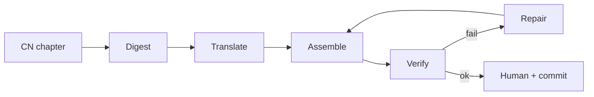
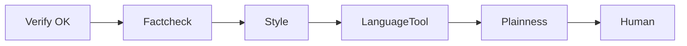

# Translation pipeline

Machine-assisted ZH → `ru` / `en` / `es` for this fork. CN chapters stay at
`book/NN-*.md`; overlays land in `book/<lang>/`. LLM never writes into
`tools/digest/` or published `book/` unless you point assemble there.

Ops detail lives next to each runtime:

| Doc | Scope |
|---|---|
| [llm/README.md](llm/README.md) | Hy-MT2 / `llama-server` / `.env` / translate + repair CLIs |
| [languagetool/README.md](languagetool/README.md) | self-hosted LT Docker on `:8010` (optional) |
| [laya/README.md](laya/README.md) | Laya System-1 HTTP on `:8090` (optional WARN spike; not on publish spine) |
| [../docs/pipeline/translation-playbook.md](../docs/pipeline/translation-playbook.md) | experience notes / full command list |
| [../docs/pipeline/add-chapter.md](../docs/pipeline/add-chapter.md) | checklist for one chapter |
| [../TRANSLATION.md](../TRANSLATION.md) | conventions (byte-faithful zones, field labels) |

`make help` lists Make wrappers. **`make wave` = assemble + verify only.**

---

## Flow

### Required spine (publish)

Left → right. Hard-stop on verify FAIL. Repair only for `number_absent` / `banned_calque`.

| Step | Runtime | Writes |
|---|---|---|
| Digest | Python | `tools/digest/NN/` |
| Translate | LLM | `tools/runs/active/<lang>/NN/` |
| Assemble | Python | `book/<lang>/` |
| Verify | Python HARD | report only |
| Repair | LLM | dirty units in the run workdir, then Assemble again |

### Optional post-verify (WARN)

Not required for `make wave` or a green chapter commit. If you run them, order is fixed:
**re-verify after any rewrite → factcheck → style → LT → plainness** (do not polish before factcheck).

| Step | Runtime | Notes |
|---|---|---|
| Factcheck | Python + judge | exit 2 if judge down; ru\|en only |
| Style | Python | per-file WARN, or `style_check --book --strict` via `make quality` |
| LanguageTool | Docker `:8010` | skip if server down, exit 0 |
| Plainness | Python WARN | ru\|en |
| Laya (spike) | HTTP `:8090` | skip if server down, exit 0; multilingual only |

Optional: simplify plain-terms (LLM) → then **verify → factcheck → style → LT** again.

---

## Blocks

### Digest — `make_digest.py`

| | |
|---|---|
| **Runtime** | Python (`make digest CH=NN`) |
| **In → out** | `book/NN-*.md` → `tools/digest/NN/units/*.md` + `blocks.json` |
| **Why** | Split one chapter into 1–2 KB units. Tags and sources leave the unit as `§TAG§` / `§SRC§`; real bytes stay in `blocks.json` so the LLM cannot rewrite them. |
| **Notes** | Never feed a whole `book/*.md` to a model. Digest tree is gitignored / regenerated. |

### Translate — `tools/llm/translate_unit.py`

| | |
|---|---|
| **Runtime** | Python client → OpenAI-compatible LLM (local `llama-server` or cloud) |
| **In → out** | one digest unit + prompts/glossary → `tools/runs/active/<lang>/<NN>/units/` |
| **Why** | ZH → target language for one item (or head). Field labels from `tools/rules/<lang>.json`. |
| **Needs** | [llm/README.md](llm/README.md): Hy-MT2 GGUF, server on `:8080`, `.env` (`HTLB_LLM_*`). Q8 on 48 GB Mac → one worker (`-np 1`). |

### Assemble — `assemble.py`

| | |
|---|---|
| **Runtime** | Python (`make assemble CH=NN LANG=ru`) |
| **In → out** | run workdir units + digest `blocks.json` → `book/<lang>/NN-*.md` |
| **Why** | Re-inject byte-faithful tags/sources; build the published overlay chapter. |
| **Notes** | Workdir = parent of `units/` (canonical: `tools/runs/active/<lang>/<NN>`). |

### Verify — `verify.py`

| | |
|---|---|
| **Runtime** | Python (`make verify CH=NN LANG=ru`) |
| **In → out** | CN chapter vs overlay → stdout report (`--json` for machines) |
| **Why** | HARD gate: item counts, tags, sources byte-equal, no CJK leaks, numbers/calques. |
| **Exit** | `0` pass · `1` FAIL (stop) · repair path for `number_absent` / `banned_calque` only |

### Repair — `tools/llm/repair_wave.py`

| | |
|---|---|
| **Runtime** | Python + same LLM as translate |
| **In → out** | assembled MD + verify JSON → dirty units fixed in the run workdir → re-assemble |
| **Why** | Auto-fix located number/calque fails (≤8 units/round, ≤3 rounds; optional retranslate fallback). |
| **Notes** | No style/LT inside the loop. Preview map: `--dry-locate`. See [llm/README.md](llm/README.md). |

### Factcheck — `tools/validate/factcheck.py` (optional)

| | |
|---|---|
| **Runtime** | Python + live judge (API / local ollama) or `--stdin-verdict` mock |
| **In → out** | CN unit + TR unit → JSON under `tools/validate/results/factcheck/` |
| **Why** | Pass E: meaning vs Chinese **after** verify, **before** style/LT. |
| **Exit** | `0` pass · `1` gate fail / ungrounded · `2` judge unavailable |
| **Notes** | `--lang` ru\|en today (es N/A). Not part of `make wave`. |

### Style — `style_check.py` (optional per chapter; book gate via `make quality`)

| | |
|---|---|
| **Runtime** | Python (`make style CH=NN LANG=ru` or `style_check.py --book --lang ru [--strict]`) |
| **In → out** | chapter MD or whole `book/<lang>/` → WARN / JSON |
| **Why** | Bureaucratese / calque / inverse rewrite markers from `tools/rules/<lang>.json` (+ glossary on per-file mode). |
| **Exit** | per-file: always `0`. `--book --strict`: `1` if findings (`make quality`). |
| **Notes** | `tools/bureaucratese.py` is a deprecated shim to `--book`. |

### Laya triage — `tools/laya/triage.py` (optional WARN)

| | |
|---|---|
| **Runtime** | Python → style_check → HTTP Laya `:8090` (`make triage CH=NN LANG=ru`) |
| **In → out** | RU style hits for `этих-вместо-данных` / `согласно-творительный` / `при-родительный-после-рамок` → cards `bug\|ok\|unclear\|skip_server_down` |
| **Why** | Confirm or dismiss a few high-noise RU markers without HARD-failing the chapter. |
| **Needs** | [laya/README.md](laya/README.md). Server down → skip, exit `0`. `--apply` reserved (default off; no autofix). |

### LanguageTool — `lt_check.py` (optional)

| | |
|---|---|
| **Runtime** | Python → HTTP `http://127.0.0.1:8010` (Docker `erikvl87/languagetool`) |
| **In → out** | plain-terms lines only → WARN / skip |
| **Why** | Grammar/spelling hints; never HARD-fail the chapter. |
| **Needs** | [languagetool/README.md](languagetool/README.md). Server down → skip, exit `0`. Prefer LT **after** Q8 translate waves on 48 GB Mac. |

### Plainness — `python3 -m tools.validate.plainness` (optional)

| | |
|---|---|
| **Runtime** | Python WARN |
| **Why** | Extra readability signal on plain-terms (ru/en; es fields limited). |

### Laya — `tools/laya/` (optional spike + triage)

| | |
|---|---|
| **Runtime** | Python → HTTP `http://127.0.0.1:8090` (`laya-serve`, multilingual) |
| **In → out** | health / `/v1/systemone` probe; `make triage` → WARN cards |
| **Why** | Typed System-1 decisions for RU style triage (данные/эти, согласно, при). |
| **Needs** | [laya/README.md](laya/README.md). Server down → skip, exit `0`. Do not co-load with Hy-MT2 Q8 on 48 GB. |

### Human + commit

Tone, titles, Cost tags, ES parity by eye. One chapter ≈ one commit; overlay only via MR + squash to `main`.

---

## What to start (checklist)

| Need | How |
|---|---|
| Python ≥ 3.11 venv | repo root; `PYTHONPATH=.` or use `make …` |
| Local translate/repair | [llm/README.md](llm/README.md) — build llama.cpp, download Hy-MT2 GGUF, `llama-server` / `start-llama-server.sh`, copy `.env.example` → `.env` |
| Factcheck live (optional) | `ZAI_API_KEY` or `judge.backend: local-ollama` — else expect exit `2` |
| LanguageTool (optional) | `docker run … -p 8010:8010 erikvl87/languagetool` — skip is OK |
| Laya (optional) | `pip install -r tools/laya/requirements-laya.txt` then `./tools/laya/start-laya-server.sh` — skip is OK |
| Cloud LLM instead of local | same `.env` (`HTLB_LLM_BASE_URL` / `MODEL` / `API_KEY`); no llama-server |

Workdirs under `tools/runs/` and digests under `tools/digest/` are local state (gitignored). Publication is `book/<lang>/` + `translations.json` via MR.

Research / calibration CLIs live under [`validate/research/`](validate/research/) and are **not** on the publish spine.
